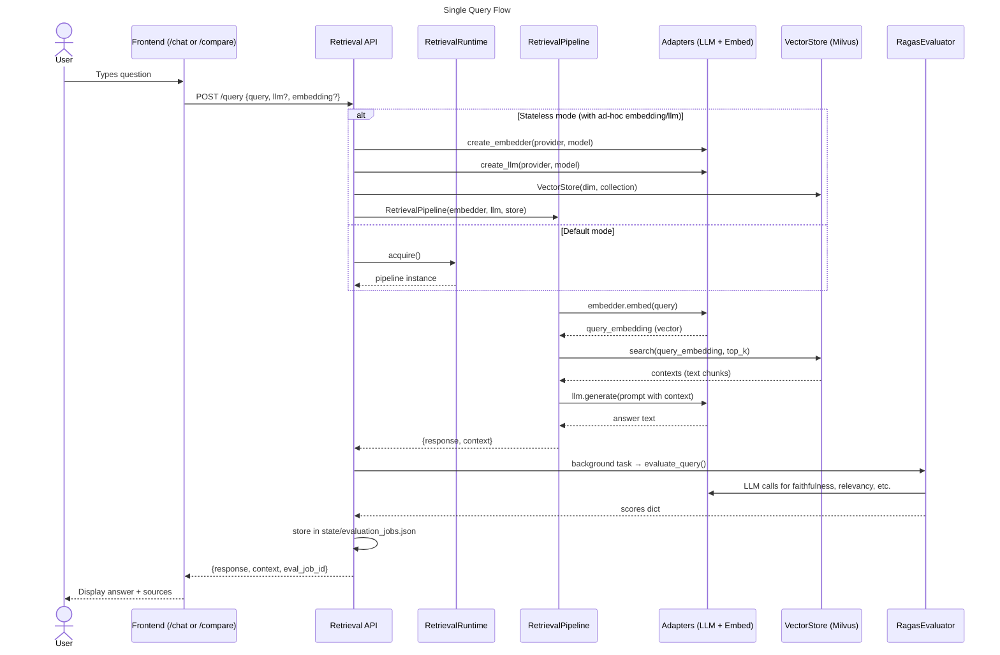
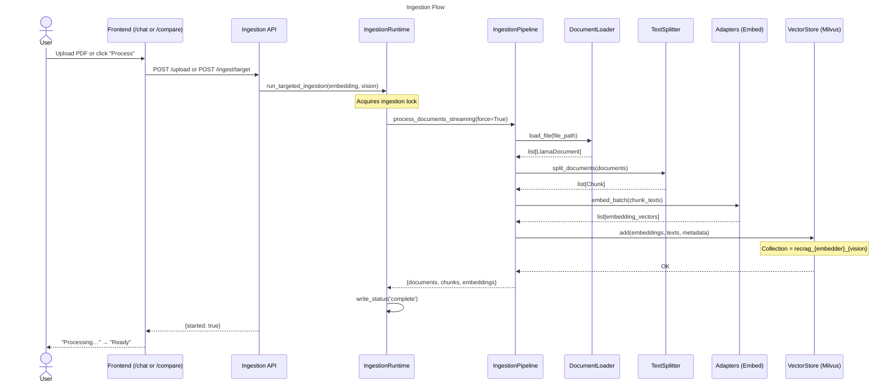

# RecRAG Architecture

```mermaid
---
title: RecRAG System Architecture
---
flowchart TB
    subgraph Frontend["Frontend (Next.js /app & /src/features)"]
        direction TB
        ChatWorkbench["/chat\nChatWorkbench\nUpload docs, ask questions"]
        CompareWorkbench["/compare\nModelComparisonWorkbench\nSide-by-side A/B comparison"]
    end

    subgraph API["API Layer (FastAPI)"]
        direction TB
        subgraph RetrievalAPI["app/retrieval/main.py"]
            R_Health["GET /health"]
            R_Config["GET /config"]
            R_Query["POST /query\n(query + ad-hoc llm/embedding overrides)"]
            R_SetConfig["POST /config\n(hot-reload pipeline)"]
            R_Providers["GET /providers\n(live model discovery)"]
            R_EvalStatus["GET /evaluate/{job_id}"]
            R_Metrics["GET /metrics"]
        end
        subgraph IngestionAPI["app/ingestion/main.py"]
            I_Health["GET /health"]
            I_Status["GET /status\n(ingestion progress)"]
            I_Upload["POST /upload"]
            I_Reindex["POST /reindex"]
            I_Targeted["POST /ingest/target\n(per-embedder ingest)"]
            I_IndexStatus["POST /status/index"]
            I_Config["POST /config"]
            I_Delete["DELETE /documents/{name}"]
            I_Files["GET /files"]
        end
    end

    subgraph Runtime["Runtime Layer (src/runtime/)"]
        direction TB
        RetrievalRuntime["RetrievalRuntime\n• warm() → load pipeline\n• acquire() → get pipeline\n• reload() → swap config\n• get_active_config()\n• shutdown()\nState: STARTING → HEALTHY\n       → DEGRADED → RELOADING\nThread-safe, drain-aware"]
        IngestionRuntime["IngestionRuntime\n• warm()\n• acquire()\n• run_ingestion()\n• run_targeted_ingestion()\n• update_embedding_default()\n• shutdown()\nSame lifecycle state machine"]
        base["base.py\nRuntimeState (StrEnum)\nPipelineRuntime Protocol\nclose_pipeline_resources()"]
    end

    subgraph Pipelines["Pipeline Layer (src/pipelines/)"]
        direction TB
        RetrievalPipeline["RetrievalPipeline\n• retrieve(query) → contexts\n• generate(query, context) → text\n• query(query) → {response, context}\nToken-aware context truncation\nSupports per-query LLM/embed overrides"]
        IngestionPipeline["IngestionPipeline\n• process_documents_streaming()\n• process_all_documents()\nBatch processing\nText + Vision extraction modes"]
        PipelineBase["base.py\n• create_embedder_from_config()\n• create_llm_from_config()\n• create_vector_store_from_config()\n• get_milvus_uri()\n• get_collection_name()\nDefaults & shared factories"]
    end

    subgraph Adapters["Adapter Layer (src/adapters/)"]
        direction TB
        Base["base.py\nBaseLLM, BaseEmbedder\n(ABC + provider attribute)"]
        Registry["__init__.py\nregister_* / create_* / list_*\nProvider registry pattern"]
        LLMs["LLM Providers\nOpenAILLM\nOllamaLLM\nNIMLLM\nGeminiLLM"]
        Embedders["Embedding Providers\nOpenAIEmbedder\nOllamaEmbedder\nNIMEmbedder\nGeminiEmbedder"]
        Vision["Vision Extractors\nOpenAIVisionExtractor\nOllamaVisionExtractor\nNIMVisionExtractor\nGeminiVisionExtractor"]
    end

    subgraph Evaluation["Evaluation Layer (src/evaluation/)"]
        direction TB
        RagasEvaluator["RagasEvaluator\n(custom — no external ragas dep)\n• faithfulness\n• answer_relevancy\n• context_precision\n• context_recall\nEach metric = 1-2 LLM calls\nwith structured prompts"]
        EvalJobs["utils/eval_jobs.py\n• create_eval_job()\n• update_eval_job()\n• read_eval_jobs()\nThread-safe JSON persistence\n→ state/evaluation_jobs.json"]
    end

    subgraph Stores["Vector Store (src/stores.py)"]
        direction TB
        VectorStore["VectorStore (Milvus)\n• add(embeddings, docs, meta)\n• search(query_embedding, k)\n• delete_all() / delete_by_filter()\n• delete_document(source)\nSupports:\n  - Milvus Lite (embedded file)\n  - Milvus Server (cloud/local)\nCollection-per-embedder naming"]
    end

    subgraph Config["Config (src/config.py)"]
        direction TB
        TOML["config.toml\nTOML with ${VAR:-default}\nenv var substitution\nSections:\n  embedding, llm, vision\n  ingestion, retrieval\n  storage, frontend"]
        Helpers["Helpers\n• find_config_path()\n• load_config()\n• get_config_value()\n• get_storage_dir()\n• get_ingestion_dir()\n• get_frontend_origins()"]
    end

    subgraph Utilities["Cross-cutting (src/)"]
        direction TB
        Models["models/api.py\nPydantic request/response models"]
        Auth["auth.py\nAPI key verification"]
        Metrics["metrics.py\nPrometheus metrics + middleware"]
        Logging["structured_logging.py\nRequest logging middleware"]
        Validation["validation.py\nFilename sanitization, size checks"]
        IO["utils/_io.py\natomic_write_json, now()"]
        RateLimit["utils/rate_limit.py\nRate limiting helpers"]
        Providers["providers.py\nLive model listing from\nOpenAI / Ollama / NIM APIs"]
        Loaders["loaders.py\nPDFLoader, VisionPDFLoader\nLiteparseLoader"]
        Splitters["splitters.py\nSentenceTextSplitter\n(chunk_size, chunk_overlap)"]
    end

    subgraph Missing["❌ What's Missing — Experiment Engine"]
        direction TB
        Gap["No batch experiment orchestrator\n\nCannot define a grid of configs\nand run them all at once.\n\nMissing:\n• Experiment model (grid + dataset)\n• Scheduler (iterate combos)\n• Aggregator (collect eval scores)\n• Ranker (compare results)\n• Dataset upload/management\n\nCurrent: manual 2-slot A/B only"]
    end

    %% ── Data flow connections ──

    Frontend -->|HTTP| API

    RetrievalAPI -->|calls| RetrievalRuntime
    IngestionAPI -->|calls| IngestionRuntime

    RetrievalRuntime -->|builds/acquires| RetrievalPipeline
    IngestionRuntime -->|builds/acquires| IngestionPipeline
    RetrievalRuntime -->|background: eval| Evaluation

    RetrievalPipeline -->|uses| Adapters
    RetrievalPipeline -->|uses| Stores
    RetrievalPipeline -->|uses| Config
    IngestionPipeline -->|uses| Adapters
    IngestionPipeline -->|uses| Stores
    IngestionPipeline -->|uses| Config
    IngestionPipeline -->|uses| Loaders
    IngestionPipeline -->|uses| Splitters

    PipelineBase -->|factory calls| Adapters
    PipelineBase -->|factory calls| Stores
    PipelineBase -->|reads| Config

    Evaluation -->|calls| Adapters

    Adapters -->|uses| Registry

    RetrievalAPI -->|calls| Providers

    %% ── Labels ──

    classDef frontend fill:#6366f1,color:#fff
    classDef api fill:#2563eb,color:#fff
    classDef runtime fill:#059669,color:#fff
    classDef pipeline fill:#0d9488,color:#fff
    classDef adapter fill:#7c3aed,color:#fff
    classDef eval fill:#d97706,color:#fff
    classDef store fill:#dc2626,color:#fff
    classDef config fill:#1d4ed8,color:#fff
    classDef util fill:#4b5563,color:#fff
    classDef missing fill:#991b1b,color:#fff,stroke:#ef4444,stroke-width:3px

    class Frontend frontend
    class RetrievalAPI,IngestionAPI api
    class RetrievalRuntime,IngestionRuntime,base runtime
    class RetrievalPipeline,IngestionPipeline,PipelineBase pipeline
    class Base,Registry,LLMs,Embedders, Vision adapter
    class RagasEvaluator,EvalJobs eval
    class VectorStore store
    class TOML,Helpers config
    class Models,Auth,Metrics,Logging,Validation,IO,RateLimit,Providers,Loaders,Splitters util
    class Gap missing
```

## Data Flow — Current Query Lifecycle



## Data Flow — Current Ingestion Lifecycle



## Existing Files

| Path | Type | Status |
|------|------|--------|
| `src/adapters/` | Library | ✅ Production-ready |
| `src/pipelines/` | Library | ✅ Production-ready |
| `src/runtime/` | Library | ✅ Production-ready |
| `src/stores.py` | Library | ✅ Production-ready |
| `src/evaluation/` | Library | ✅ Functional |
| `src/config.py` | Library | ⚠️ Dict-based, needs typed model |
| `src/loaders.py` | Library | ✅ Production-ready |
| `src/splitters.py` | Library | ✅ Production-ready |
| `src/providers.py` | Library | ✅ Production-ready |
| `src/auth.py` | Library | ✅ Production-ready |
| `src/metrics.py` | Library | ✅ Production-ready |
| `src/models/api.py` | Library | ⚠️ Needs experiment models |
| `src/utils/*` | Library | ✅ Production-ready |
| `app/retrieval/main.py` | API | ✅ Production-ready |
| `app/ingestion/main.py` | API | ✅ Production-ready |
| `jobs/ingest.py` | CLI | ✅ Functional |
| `jobs/evaluate.py` | CLI | ✅ Functional |
| `jobs/smoke_test.py` | CLI | ✅ Functional |
| `frontend/` | UI | ⚠️ Needs experiment UI |
| `src/experiments/` | **Missing** | ❌ [Gap] Experiment orchestrator |
| `app/experiments/` or endpoints | **Missing** | ❌ [Gap] Experiment API |
