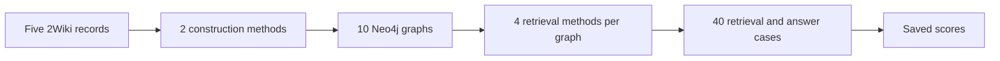

# 2WikiMultiHopQA results

2WikiMultiHopQA contains questions that need facts from more than one source
passage. The dataset module reads the records from
[`datasets/2wikimultihopqa/dev.json`](../datasets/2wikimultihopqa/dev.json),
including source pages, supporting passages, evidence fields, and expected
answers. `answer_aliases()` resolves aliases from `id_aliases.json`.

The tables on this page are transcribed from the saved report
[`results/recrag/2026090905_report.pdf`](../results/recrag/2026090905_report.pdf).

## Example record

- Record ID: `8813f87c0bdd11eba7f7acde48001122`
- Question: Who is the mother of the director of film *Polish-Russian War (Film)*?
- Expected answer: Małgorzata Braunek

Supporting facts:

1. Page: `Polish-Russian War (film)`
   Passage 1:

   > Polish-Russian War (Wojna polsko-ruska) is a 2009 Polish film directed by Xawery Żuławski based on the novel Polish-Russian War under the white-red flag by Dorota Masłowska.

2. Page: `Xawery Żuławski`
   Passage 2:

   > He is the son of actress Małgorzata Braunek and director Andrzej Żuławski.

## Retrieval methods

| Method | How it searches |
| --- | --- |
| `text2cypher` | The AI reads the graph structure and writes a Neo4j query. Neo4j runs that query and returns the matching graph records. Example: For "Who founded the company acquired by X?", the AI follows the founder and acquisition relationships. |
| `agentic` | The AI chooses between two tools: vector search or a graph query. It can review the first result and run another search with a better question. Example: It may find related text first, then use a graph query to confirm the relationship. |
| [`vector_cypher`](https://neo4j.com/docs/neo4j-graphrag-python/current/user_guide_rag.html#vector-cypher-retriever) | The system turns the question into a number-based meaning pattern. It compares that pattern with stored text chunks and uses a Cypher query to add graph context. Example: "How did the company grow?" can find "The company expanded into new markets." |
| [`hybrid_cypher`](https://neo4j.com/docs/neo4j-graphrag-python/current/user_guide_rag.html#hybrid-cypher-retrievers) | It runs two searches together: one by meaning and one by exact words. It combines both result sets, then uses a Cypher query to add related entities and graph facts from Neo4j. Example: For "What did HPE acquire in 2022?", it searches both related content and the exact terms `HPE` and `2022`. |

## Construction results

Scores are averages over 5 records. Each judge score runs from 0 to 1. G, C,
and S in the per-record table mean groundedness, completeness, and supporting
evidence coverage, in that order.

| Construction | Groundedness | Completeness | Supporting evidence coverage |
| --- | ---: | ---: | ---: |
| Standard | 0.56 | 0.44 | 0.34 |
| Ontology-guided | 0.78 | 0.58 | 0.64 |

- Groundedness: Are graph facts supported by the source text?
- Completeness: How much source information did the graph capture?
- Supporting evidence coverage: How much information from the dataset's supporting passages did the graph capture?

Ontology-guided construction scored higher on all three metrics.

| Record | Standard G / C / S | Ontology-guided G / C / S |
| ---: | --- | --- |
| 1 | 0.60 / 0.30 / 0.70 | 0.90 / 0.70 / 0.70 |
| 2 | 0.30 / 0.30 / 0.20 | 0.50 / 0.60 / 0.20 |
| 3 | 0.90 / 0.90 / 0.70 | 0.90 / 0.70 / 0.90 |
| 4 | 0.30 / 0.30 / 0.10 | 0.90 / 0.80 / 0.70 |
| 5 | 0.70 / 0.40 / 0.00 | 0.70 / 0.10 / 0.70 |

The report also recorded these average graph size and quality checks:

| Construction | Avg build seconds | Avg triples | Avg entities | Avg relationship types | Avg duplicate groups | Avg duplicate nodes | Avg self-loops |
| --- | ---: | ---: | ---: | ---: | ---: | ---: | ---: |
| Standard | 30.74 | 46.40 | 55.20 | 8.80 | 0.00 | 17.60 | 0.00 |
| Ontology-guided | 41.45 | 70.80 | 65.80 | 26.40 | 0.60 | 1.20 | 0.60 |

## Retrieval and answer results

All scores are averages over 5 records. Retrieval uses `top_k=5`, or the top
five returned items.

| Construction | Retrieval | Contextual precision | Contextual recall | Contextual relevancy | Answer relevancy | Correctness | Faithfulness | Alias match |
| --- | --- | ---: | ---: | ---: | ---: | ---: | ---: | ---: |
| Standard | `text2cypher` | 0.60 | 0.30 | 0.60 | 1.00 | 0.60 | 0.67 | 1/5 |
| Standard | `agentic` | 0.87 | 1.00 | 0.13 | 1.00 | 1.00 | 1.00 | 0/5 |
| Standard | `vector_cypher` | 0.94 | 1.00 | 0.15 | 1.00 | 1.00 | 1.00 | 1/5 |
| Standard | `hybrid_cypher` | 0.92 | 1.00 | 0.13 | 1.00 | 1.00 | 1.00 | 1/5 |
| Ontology-guided | `text2cypher` | 0.20 | 0.00 | 0.20 | 0.20 | 0.20 | 1.00 | 0/5 |
| Ontology-guided | `agentic` | 0.91 | 0.80 | 0.21 | 1.00 | 0.98 | 0.80 | 0/5 |
| Ontology-guided | `vector_cypher` | 0.86 | 1.00 | 0.19 | 1.00 | 0.98 | 1.00 | 0/5 |
| Ontology-guided | `hybrid_cypher` | 0.94 | 1.00 | 0.12 | 1.00 | 0.98 | 1.00 | 1/5 |

- Contextual precision: Relevant results appear higher in the ranked context.
- Contextual recall: How much required supporting information was retrieved.
- Contextual relevancy: How relevant the retrieved context is to the question.
- Answer relevancy: Whether the answer addresses the question.
- Answer correctness: Whether the answer matches the expected answer and aliases.

### Faithfulness and exact answer match

- Standard:
  - `text2cypher` faithfulness: `0.67` on 3 cases with context.
  - `agentic`, `vector_cypher`, and `hybrid_cypher`: `1.00`.
- Ontology-guided:
  - `text2cypher` faithfulness: `1.00` on 1 case with context.
  - `agentic`: `0.80`.
  - `vector_cypher` and `hybrid_cypher`: `1.00`.

Faithfulness is not scored when retrieval returns no context. Exact normalized
answer matches were low because this check requires the full answer to equal the
expected answer or an alias. Explanatory answers can be correct while failing
this strict check.

## What this run shows

- Ontology-guided construction scored higher on all three construction checks.
- Standard `vector_cypher` and `hybrid_cypher` retrieval had 1.00 contextual recall and 1.00 answer correctness on average.
- Standard `vector_cypher` and ontology-guided `hybrid_cypher` tied for the highest average contextual precision at 0.94.
- `text2cypher` was the weakest retrieval method in this run.
- The alias check is strict. Longer correct answers can fail the full-answer match.

These results cover five records. They compare the eight combinations inside
this run. They do not establish a ranking for every 2WikiMultiHopQA question.
