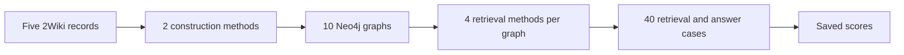

# 2WikiMultiHopQA results

2WikiMultiHopQA contains questions that need facts from more than one source
passage. The dataset module reads the records from
[`datasets/2wikimultihopqa/dev.json`](../datasets/2wikimultihopqa/dev.json),
including source pages, supporting passages, evidence fields, and expected
answers. `answer_aliases()` resolves aliases from `id_aliases.json`.

The tables on this page are transcribed from the saved report
[`results/recrag/2026090905_report.pdf`](../results/recrag/2026090905_report.pdf).

## Run at a glance

| Item | Value |
| --- | --- |
| Data | `2wikimultihopqa/dev.json` |
| Records | 5 |
| Questions per record | 1 |
| Source pages per record | 10 |
| Graph construction methods | Standard, ontology-guided |
| Retrieval methods | Text2Cypher, agentic, vector, hybrid |
| Graphs built | 10 |
| Retrieval and answer cases | 40 |
| Run errors | 0 |
| Chat and judge model | `gpt-5.6-terra`, reasoning effort `xhigh` |
| Embedding model | `text-embedding-3-small`, 1,536 dimensions |
| Retrieved items scored | Top 5 |

## Construction results

These are average scores over the five records. Each judge score runs from 0 to
1. G, C, and S in the per-record table mean groundedness, completeness, and
supporting evidence coverage, in that order.

| Construction | Groundedness | Completeness | Supporting evidence coverage |
| --- | ---: | ---: | ---: |
| Standard | 0.56 | 0.44 | 0.34 |
| Ontology-guided | 0.78 | 0.58 | 0.64 |

| Record | Standard G / C / S | Ontology-guided G / C / S |
| ---: | --- | --- |
| 1 | 0.60 / 0.30 / 0.70 | 0.90 / 0.70 / 0.70 |
| 2 | 0.30 / 0.30 / 0.20 | 0.50 / 0.60 / 0.20 |
| 3 | 0.90 / 0.90 / 0.70 | 0.90 / 0.70 / 0.90 |
| 4 | 0.30 / 0.30 / 0.10 | 0.90 / 0.80 / 0.70 |
| 5 | 0.70 / 0.40 / 0.00 | 0.70 / 0.10 / 0.70 |

The report also recorded these average graph size and quality checks:

| Construction | Avg build seconds | Avg triples | Avg entities | Avg relationship types | Avg duplicate groups | Avg duplicate nodes | Avg self-loops |
| --- | ---: | ---: | ---: | ---: | ---: | ---: | ---: |
| Standard | 30.74 | 46.40 | 55.20 | 8.80 | 0.00 | 17.60 | 0.00 |
| Ontology-guided | 41.45 | 70.80 | 65.80 | 26.40 | 0.60 | 1.20 | 0.60 |

## Retrieval and answer results

These are average scores over the five records. Retrieval scores use the top
five returned items.

| Construction | Retrieval | Contextual precision | Contextual recall | Contextual relevancy | Answer relevancy | Correctness | Faithfulness | Alias match |
| --- | --- | ---: | ---: | ---: | ---: | ---: | ---: | ---: |
| Standard | `text2cypher` | 0.60 | 0.30 | 0.60 | 1.00 | 0.60 | 0.67 | 1/5 |
| Standard | `agentic` | 0.87 | 1.00 | 0.13 | 1.00 | 1.00 | 1.00 | 0/5 |
| Standard | `vector` | 0.94 | 1.00 | 0.14 | 1.00 | 1.00 | 1.00 | 1/5 |
| Standard | `hybrid` | 0.92 | 1.00 | 0.13 | 1.00 | 1.00 | 1.00 | 1/5 |
| Ontology-guided | `text2cypher` | 0.20 | 0.00 | 0.20 | 0.20 | 0.20 | 1.00 | 0/5 |
| Ontology-guided | `agentic` | 0.91 | 0.80 | 0.21 | 1.00 | 0.98 | 0.80 | 0/5 |
| Ontology-guided | `vector` | 0.86 | 1.00 | 0.19 | 1.00 | 0.98 | 1.00 | 0/5 |
| Ontology-guided | `hybrid` | 0.94 | 1.00 | 0.12 | 1.00 | 0.98 | 1.00 | 1/5 |

Faithfulness uses only cases with retrieved context. The report notes that a
dash means no case in that row had a faithfulness score. The average table
contains `1.00` for ontology-guided `text2cypher` because one case had context.

## What this run shows

- Ontology-guided construction scored higher on all three construction checks.
- Standard vector and hybrid retrieval had 1.00 contextual recall and 1.00 answer correctness on average.
- Standard vector and ontology-guided hybrid tied for the highest average contextual precision at 0.94.
- `text2cypher` was the weakest retrieval method in this run.
- The alias check is strict. Longer correct answers can fail the full-answer match.

These results cover five records. They compare the eight combinations inside
this run. They do not establish a ranking for every 2WikiMultiHopQA question.
The [findings page](findings.md) records the current provisional
interpretation, and the [experiment registry](experiment-registry.md) lists the
saved runs.
