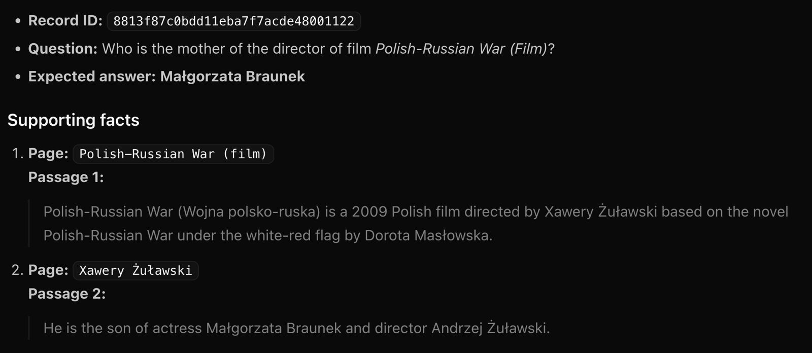
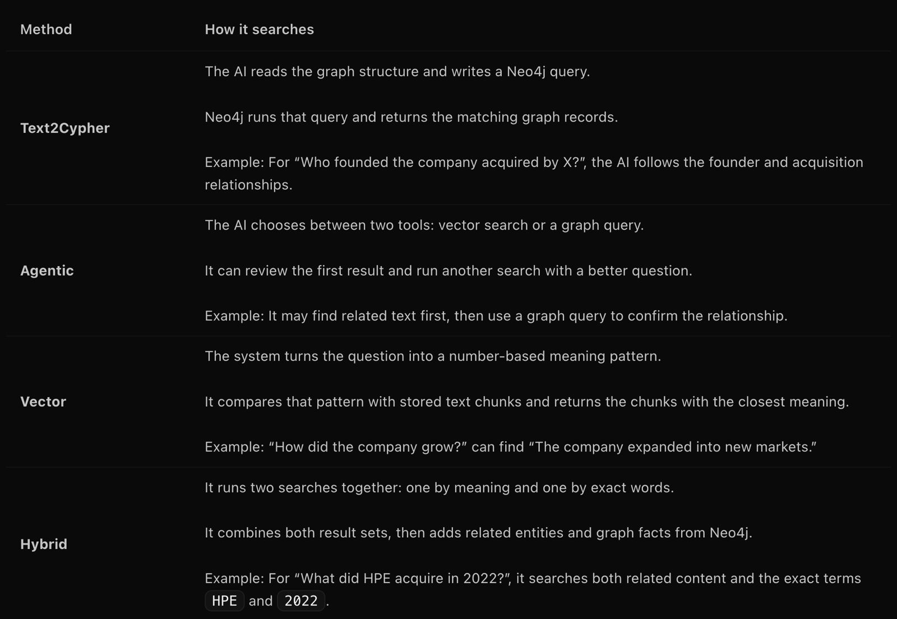
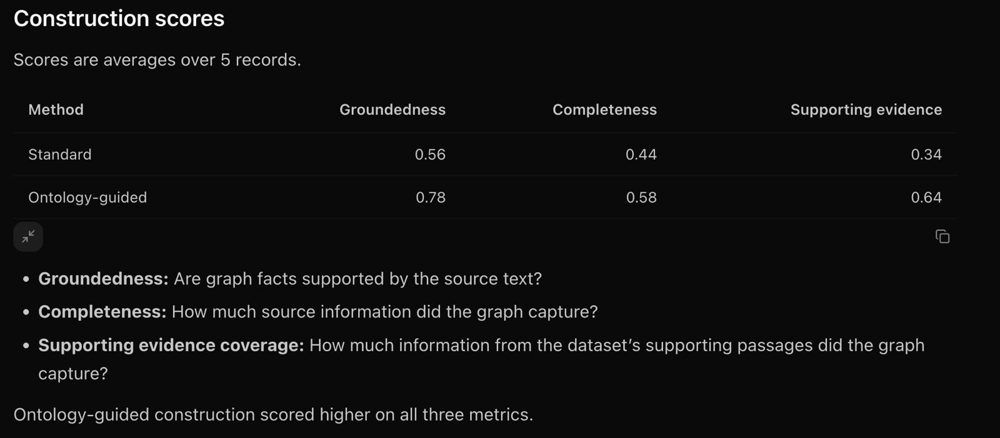
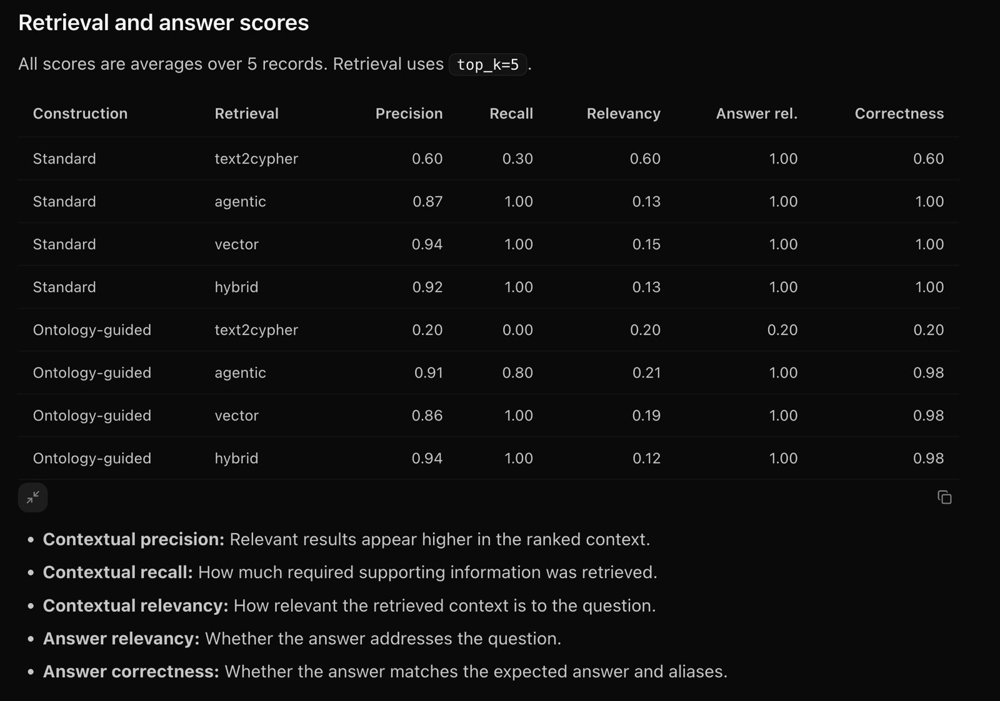
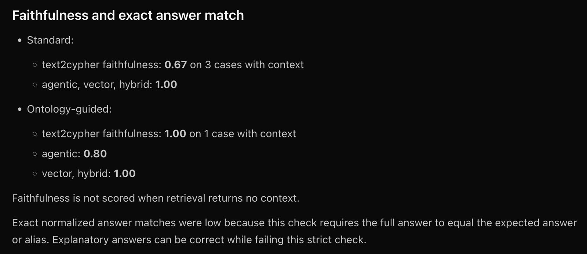

# 2WikiMultiHopQA experiment

2WikiMultiHopQA tests questions that need more than one step of reasoning. The
answer may require a fact about one page and a second fact about a related page.
The current dataset module reads the `dev.json` file and keeps the source pages,
supporting facts, evidence triples, and expected answer. During evaluation, the
module also resolves answer aliases from `id_aliases.json`.

The scores in this document came from the supplied experiment notes. The
repository contains the loader and evaluation code, but I did not find a
committed 2Wiki result report.

## Example question

Record `8813f87c0bdd11eba7f7acde48001122` asks:

> Who is the mother of the director of film *Polish-Russian War (Film)*?

The expected answer is Małgorzata Braunek. The supporting facts provide the two
steps needed to reach it:

1. *Polish-Russian War* was directed by Xawery Żuławski.
2. Xawery Żuławski was the son of Małgorzata Braunek.

## What the experiment changes

The experiment changes two parts of the system separately.

Construction changes how source text becomes a graph. Retrieval changes how the
system searches that graph for context.

### Construction methods

- **Standard** uses the default `neo4j-graphrag` extraction schema and prompt.
- **Ontology-guided** gives the extractor fixed top-level kinds such as Person,
  Organization, Place, CreativeWork, Event, Concept, and Thing. It still allows
  additional kinds and relationships.

The comparison asks whether naming common entity kinds and extraction rules
helps the graph capture the source facts.

### Retrieval methods

| Method | What the code does | Why it exists |
| --- | --- | --- |
| `text2cypher` | Gives the graph schema to an LLM. The retriever generates a Cypher query and runs it against Neo4j. | Tests direct graph queries for relationship-heavy questions. |
| `agentic` | Gives an agent a vector-search tool and a Cypher-search tool. The agent can review results and refine the search. | Tests whether the agent can choose the useful search type. |
| `vector` | Searches the `chunk_embeddings` index for text with similar meaning. It adds linked entities and graph paths to each result. | Tests semantic search with graph context. |
| `hybrid` | Searches both the vector index and the `chunk_fulltext` index. It adds the same graph context as vector search. | Tests semantic search together with exact-word search. |

## Construction scores

The scores are averages over five records. Each score is between 0 and 1.

| Construction | Groundedness | Completeness | Supporting evidence coverage |
| --- | ---: | ---: | ---: |
| Standard | 0.56 | 0.44 | 0.34 |
| Ontology-guided | 0.78 | 0.58 | 0.64 |

Groundedness asks whether graph facts appear in the source text. Completeness
asks how much source information the graph captures. Supporting evidence
coverage asks how much information from the dataset's supporting passages the
graph captures.

Ontology-guided construction scored higher on all three measures in this run.

## Retrieval and answer scores

These scores are also averages over five records. Retrieval evaluation checks
the first five returned items, using `top_k=5`.

| Construction | Retrieval | Precision | Recall | Context relevance | Answer relevance | Correctness |
| --- | --- | ---: | ---: | ---: | ---: | ---: |
| Standard | `text2cypher` | 0.60 | 0.30 | 0.60 | 1.00 | 0.60 |
| Standard | `agentic` | 0.87 | 1.00 | 0.13 | 1.00 | 1.00 |
| Standard | `vector` | 0.94 | 1.00 | 0.15 | 1.00 | 1.00 |
| Standard | `hybrid` | 0.92 | 1.00 | 0.13 | 1.00 | 1.00 |
| Ontology-guided | `text2cypher` | 0.20 | 0.00 | 0.20 | 0.20 | 0.20 |
| Ontology-guided | `agentic` | 0.91 | 0.80 | 0.21 | 1.00 | 0.98 |
| Ontology-guided | `vector` | 0.86 | 1.00 | 0.19 | 1.00 | 0.98 |
| Ontology-guided | `hybrid` | 0.94 | 1.00 | 0.12 | 1.00 | 0.98 |

Precision measures whether useful results appear near the top. Recall measures
how much required supporting information was returned. Context relevance
measures whether the returned context matches the question. Answer relevance
measures whether the answer addresses the question. Correctness measures
whether the answer matches the expected answer or an alias.

## Faithfulness and exact matching

The answer evaluator gives DeepEval the dataset's supporting sentences as
`context` and the returned items as `retrieval_context`. The faithfulness metric
therefore checks the answer against the gold supporting sentences. The
experiment did not score faithfulness when retrieval returned no context.

The recorded faithfulness scores were:

- Standard `text2cypher`: 0.67 on three cases with context.
- Standard `agentic`, `vector`, and `hybrid`: 1.00.
- Ontology-guided `text2cypher`: 1.00 on one case with context.
- Ontology-guided `agentic`: 0.80.
- Ontology-guided `vector` and `hybrid`: 1.00.

The exact answer check is strict. It normalizes the generated answer and checks
whether the full result equals the expected answer or one of its aliases. A
correct answer with an explanation can fail that check. The answer judge also
scores relevance and correctness separately.

## What this result tells us

The five-record run favors ontology-guided construction for graph quality.
Standard construction paired with vector, hybrid, or agentic retrieval produced
perfect answer relevance and correctness in the recorded table. Ontology-guided
retrieval kept answer relevance at 1.00 and correctness at 0.98 for those three
methods. `text2cypher` scored lower in both construction settings in this run.

These results are observations from five records. They are not a claim that one
method wins on every dataset.
