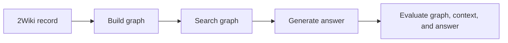
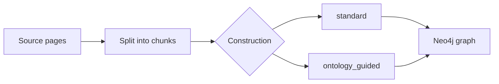
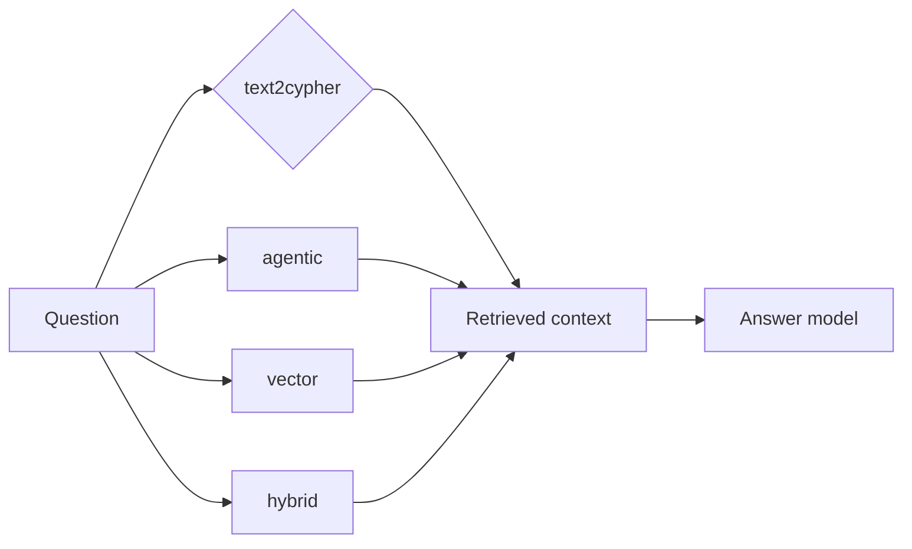
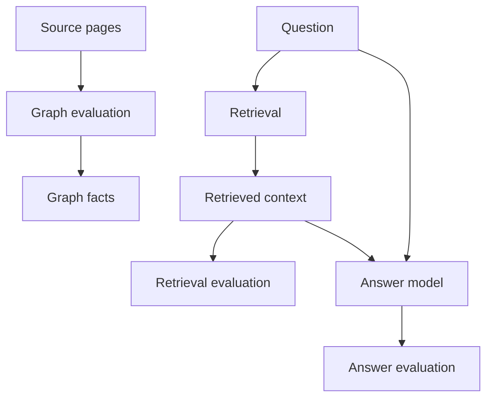

# RecRAG research

RecRAG is a collaboration between HPE and JECRC University. We are testing
which GraphRAG setup gives the best answers to questions that need facts from
more than one source passage.

GraphRAG builds a graph from source text, uses the graph to find useful context,
and asks a language model to answer from that context. A graph stores named
things, such as a film and a person, and links between them, such as "directed
by".

## The example we use

The active dataset is 2WikiMultiHopQA. Each record contains a question, source
pages, supporting passages, and a known answer.

Example question:

> Who is the mother of the director of film Polish-Russian War (Film)?

The two supporting facts are:

```text
Polish-Russian War was directed by Xawery Żuławski.
Xawery Żuławski is the son of Małgorzata Braunek.
```

The expected answer is `Małgorzata Braunek`.

## What one run does



For the example, the system should move from the film to its director, then to
the director's mother.

```text
Polish-Russian War -> Xawery Żuławski -> Małgorzata Braunek
```

## What we are testing

We change two choices. We keep the dataset, Neo4j setup, answer model, and eval
rules fixed while we compare them.

### Construction

Construction turns source pages into a graph.



| Method | What changes | Example graph result |
| --- | --- | --- |
| `standard` | The LLM uses the default extraction schema and prompt. | `film -> director -> mother` |
| `ontology_guided` | The LLM gets fixed top-level kinds and extraction rules. | The same facts, with more consistent kinds and links. |

The question is whether the guided rules preserve more useful facts from the
source pages.

### Retrieval

Retrieval chooses the context that the answer model can use.



| Method | How it finds the two facts |
| --- | --- |
| `text2cypher` | Writes a read-only graph query that follows `film -> director -> mother`. |
| `agentic` | Chooses vector search or Cypher search and can search again. |
| `vector` | Finds chunks with similar meaning, then adds nearby graph facts. |
| `hybrid` | Combines meaning search with exact-word search, then adds graph facts. |

The construction and retrieval details are in the [construction reference](graphrag/construction.md)
and [retrieval reference](graphrag/retrieval.md).

### The comparison matrix

The current study runs all eight combinations:

| | `text2cypher` | `agentic` | `vector` | `hybrid` |
| --- | --- | --- | --- | --- |
| `standard` | run | run | run | run |
| `ontology_guided` | run | run | run | run |

One construction method can produce a better graph but a worse final answer.
That is why construction and retrieval are tested together.

## What the evals measure

The dataset gives us both the source text and the expected answer. We use them
at three points:



| Stage | What we check | Why it matters |
| --- | --- | --- |
| Graph | Are extracted facts supported by the pages? Did the graph keep the supporting facts? | Retrieval cannot find a fact that construction dropped. |
| Retrieval | Did the returned items contain both facts? Were useful items near the top? | The answer model can use only the context it receives. |
| Answer | Is the answer correct, relevant, and supported by the returned context? | The final answer is the outcome we care about. |

For the example, a good run has these results:

```text
Graph:      film -> director -> mother is present and supported by the pages.
Retrieval:  both supporting passages are returned.
Answer:     Małgorzata Braunek.
```

The [evaluation reference](graphrag/evals.md) explains each metric and its limits.

## Why cost is the bottleneck

A full run does this for each record:

```text
2 graph builds
8 retrieval and answer runs
2 graph evaluations
8 retrieval evaluations
8 answer evaluations
```

The current planning estimate is about 292k tokens, or $0.16, per record with
the full matrix and all evals. At 5,000 records, that is about $805. The cost
grows with the number of records and the number of combinations.

The expensive part is often evaluation. It asks a model to judge each graph,
retrieved result, and answer. Agentic retrieval also uses more model calls than
vector or hybrid retrieval.

See [cost and model estimates](api-cost-estimate.md) for the breakdown.

## What the model changes

The current study uses `gpt-5.6-luna` with medium reasoning effort for
construction, LLM-based retrieval, answer generation, and evaluation judges.
It uses `text-embedding-3-small` for vector search.

Model choice is a separate question. To measure its effect, keep the record,
construction method, retrieval method, prompts, and eval rules fixed. Change
only the model, then compare graph quality, retrieval quality, answer quality,
token use, and cost.

The current 2Wiki results do not compare model families. They compare the eight
construction and retrieval combinations under one fixed model. A model
comparison is a natural follow-up study.

## Current result

The five-record run gives `standard + vector` the provisional lead for final
answer quality. `ontology_guided` produced the stronger graph scores. The
configuration is not locked. The next study will run all eight combinations on
a larger 2WikiMultiHopQA sample.

## Read next

- [Graph construction reference](graphrag/construction.md) describes the two
  graph-building methods and Neo4j indexes.
- [Retrieval reference](graphrag/retrieval.md) describes the four retrieval
  methods and answer flow.
- [Evaluation reference](graphrag/evals.md) describes the graph, retrieval, and
  answer checks.
- [2WikiMultiHopQA results](2wikimultihop.md) preserves the saved five-record
  result tables.
- [Cost and model estimates](api-cost-estimate.md) explains the token and cost breakdown.
- [Findings](findings.md) records the saved results.
- [Experimental methodology](methodology.md) defines the controls and completion rules.
