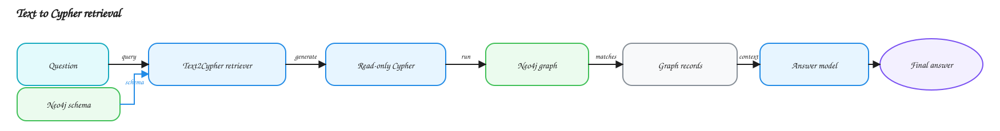
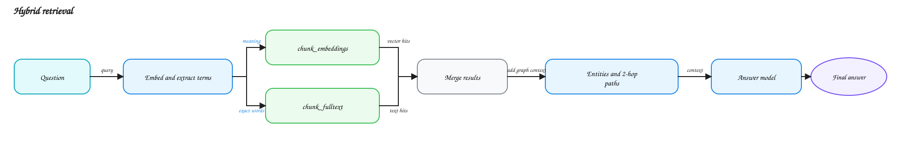
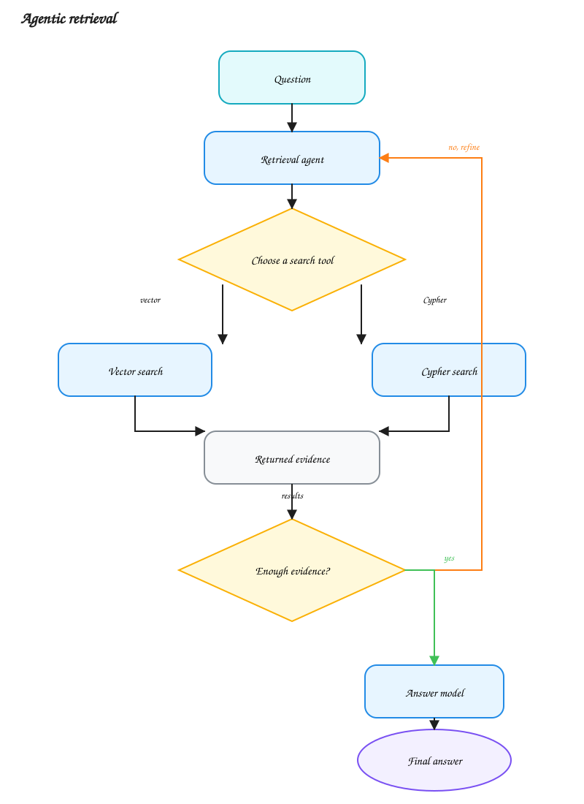

# System architecture

RecRAG runs each 2WikiMultiHopQA record through five steps:

```text
load record -> build graph -> create indexes -> retrieve context -> answer
```

The app is in `streamlit_app.py`. `GraphRAG` connects the app to Neo4j, the
language model, and the embedding model.

## Example record

The example question is:

> Who is the mother of the director of film Polish-Russian War (Film)?

Two source pages contain the answer:

```text
Polish-Russian War (film): a 2009 film directed by Xawery Żuławski.
Xawery Żuławski: he is the son of actress Małgorzata Braunek.
```

The expected answer is `Małgorzata Braunek`.

## 1. Load the record

`load_records()` reads the question, source pages, supporting passages, and
expected answer from `datasets/2wikimultihopqa/dev.json`.

For this record, it loads the pages named `Polish-Russian War (film)` and
`Xawery Żuławski` along with other source pages.

## 2. Build the graph

`GraphRAG.construct()` calls `rebuild_graph()` in
`graphrag/construction/construction.py`.

The pipeline splits the pages into 1,000-character chunks with 100 characters
of overlap. It asks the LLM to extract entities and relationships, then writes
the chunks and graph to Neo4j.

For the example, the graph should contain links like these:

```text
Polish-Russian War --directed by--> Xawery Żuławski
Xawery Żuławski --mother--> Małgorzata Braunek
```

The two construction methods change only the extraction rules:

| Method | Extraction rules |
| --- | --- |
| `standard` | Uses the default schema and prompt. |
| `ontology_guided` | Uses fixed top-level kinds and allows extra kinds and relationships. It fills fields only when the text states them. |

## 3. Create search indexes

The builder stores two indexes on the chunks before retrieval starts:

```text
question -> meaning search -> chunk_embeddings
question -> exact-word search -> chunk_fulltext
```

For the example, meaning search can find the sentence about the film and its
director. Exact-word search can find the words `Polish-Russian War` and
`Xawery Żuławski`.

- `chunk_embeddings` supports meaning-based search.
- `chunk_fulltext` supports exact-word search.

## 4. Retrieve context

Each method searches the same graph and returns context to the answer model.
For the example, useful context contains both facts:

```text
Polish-Russian War -> Xawery Żuławski
Xawery Żuławski -> Małgorzata Braunek
```

### `text2cypher`

The LLM reads the schema and writes a read-only query that follows:

```text
film -> director -> mother
```

Neo4j returns the matching graph records.



### `vector`

The retriever embeds the question, finds similar chunks, and adds the chunk's
entities and graph paths up to two edges away.


### `hybrid`

The retriever searches both indexes, merges the results, and adds the same graph
context as `vector`.



### `agentic`

The agent chooses vector search or Cypher search. It can search again if the
first result does not contain both facts. The code allows up to five model
calls.



## 5. Answer the question

The answer model receives the question and the retrieved context:

```text
Question: Who is the mother of the director of film Polish-Russian War (Film)?
Context: Polish-Russian War -> Xawery Żuławski -> Małgorzata Braunek
Answer: Małgorzata Braunek
```

If retrieval returns no context, the answer is:

```text
I could not find supporting context for this question.
```

## Evaluation

The optional DeepEval run scores the graph, retrieved context, and final answer
separately. See the [evaluation reference](evaluation.md) for the full
contract.

## Configuration

`GraphRAG.from_config()` reads settings from `config.toml` and credentials from
`.env`.

- Chat model: `gpt-5.6-luna`, with medium reasoning effort.
- Embedding model: `text-embedding-3-small`.
- Neo4j connection: `NEO4J_URI` and `NEO4J_AUTH`.
- Timeouts: `config.toml`.

## Code map

- [`streamlit_app.py`](../streamlit_app.py) runs the app.
- [`graphrag/graph_rag.py`](../graphrag/graph_rag.py) exposes construction and answering.
- [`graphrag/construction/`](../graphrag/construction/) builds graphs and indexes.
- [`graphrag/retrieval/`](../graphrag/retrieval/) selects retrievers and answers questions.
- [`graphrag/evals/`](../graphrag/evals/) scores graphs, context, and answers.
