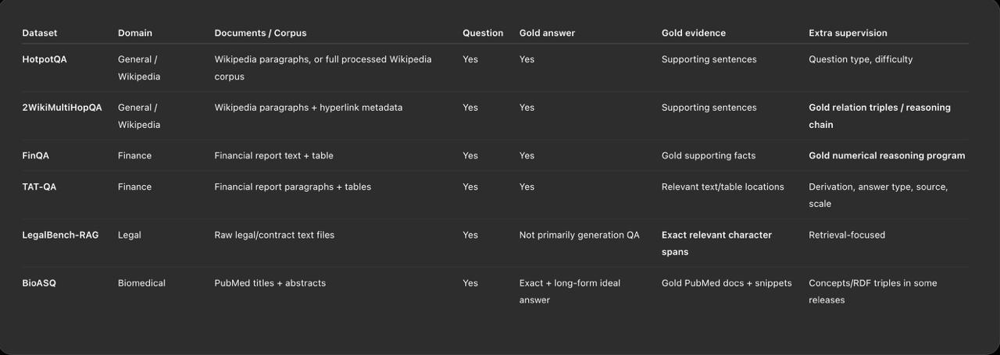

# Dataset focus

This page preserves the dataset comparison table. It is not the project
roadmap. See [Research roadmap](roadmap.md) for the active sequence and the
current decision point.

The project notes name six datasets for the next phase. They cover different
document types and different kinds of answers. This matters because a method
that works on short Wikipedia passages may not work on tables or legal text.

The focus list is a research plan. It is not a list of loaders that already
exist in the code.

## Current code status

The Streamlit app currently loads 2WikiMultiHopQA through
`graphrag/dataset_records/two_wiki_multihopqa.py`. I did not find loaders in the
current code for HotpotQA, FinQA, TAT-QA, LegalBench-RAG, or BioASQ.

| Dataset | Current status |
| --- | --- |
| 2WikiMultiHopQA | Loaded by the current app and used by the GraphRAG evaluation code. |
| HotpotQA | Focus target. A loader was not found in the current code. |
| FinQA | Focus target. A loader was not found in the current code. |
| TAT-QA | Focus target. A loader was not found in the current code. |
| LegalBench-RAG | Focus target. A loader was not found in the current code. |
| BioASQ | Focus target. A loader was not found in the current code. |

## Dataset comparison

| Dataset | Domain | Documents or corpus | Question | Gold answer | Gold evidence | Extra supervision |
| --- | --- | --- | --- | --- | --- | --- |
| HotpotQA | General, Wikipedia | Wikipedia paragraphs or the full processed Wikipedia corpus | Yes | Yes | Supporting sentences | Question type, difficulty |
| 2WikiMultiHopQA | General, Wikipedia | Wikipedia paragraphs plus hyperlink metadata | Yes | Yes | Supporting sentences | Gold relation triples, reasoning chain |
| FinQA | Finance | Financial report text plus tables | Yes | Yes | Gold supporting facts | Gold numerical reasoning program |
| TAT-QA | Finance | Financial report paragraphs plus tables | Yes | Yes | Relevant text or table locations | Derivation, answer type, source, scale |
| LegalBench-RAG | Legal | Raw legal and contract text files | Yes | Not primarily generation QA | Exact relevant character spans | Retrieval-focused |
| BioASQ | Biomedical | PubMed titles plus abstracts | Yes | Exact answer plus long-form ideal answer | Gold PubMed documents plus snippets | Concepts or RDF triples in some releases |

## What the columns mean

- **Question** means the dataset provides a question for each example.
- **Gold answer** means the dataset provides the expected answer.
- **Gold evidence** means the dataset identifies text that supports the answer.
- **Extra supervision** means the dataset provides more labels, such as a reasoning chain, table location, or answer type.

REFinD is documented in [the historical experiment note](refind-experiment.md).
The repository guide also lists Hannon and FiNER-139 as historical datasets.
