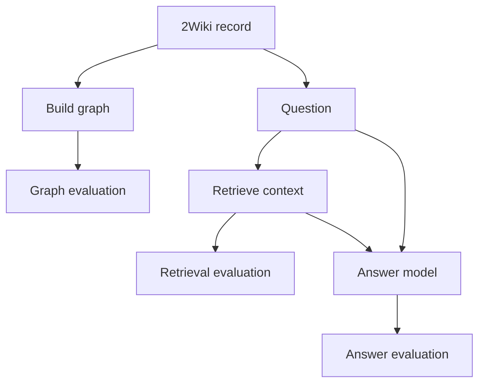

# GraphRAG evaluation

The evals answer three questions for each 2WikiMultiHopQA record:

1. Did construction put the source facts into the graph?
2. Did retrieval return the facts needed for the question?
3. Did the answer model give a correct answer from that context?

The app scores these stages separately. This shows where a method fails.

## The data used for evaluation

Each record provides the reference data:

| Data | Example from the active record | Used to check |
| --- | --- | --- |
| Question | "Who is the mother of the director of film Polish-Russian War (Film)?" | Retrieval and answer relevance |
| Source pages | The pages for the film and Xawery Żuławski | Graph groundedness and completeness |
| Supporting passages | The two passages that contain the answer | Graph evidence coverage and retrieval |
| Expected answer | `Małgorzata Braunek` | Answer correctness |
| Answer aliases | Other accepted forms, when the dataset provides them | Exact answer matching and correctness |

The loader turns each record into a `TwoWikiRecord` in
[`two_wiki_multihopqa.py`](../graphrag/dataset_records/two_wiki_multihopqa.py).
It maps the record's supporting page names and passage numbers to the original
source text.

## One record from start to finish



For the active example, the two supporting facts are:

```text
Polish-Russian War was directed by Xawery Żuławski.
Xawery Żuławski is the son of Małgorzata Braunek.
```

A strong result keeps both facts in the graph, returns both supporting
passages, and answers `Małgorzata Braunek`.

## 1. Graph evaluation

Graph evaluation checks the output of construction before retrieval runs.
`evaluate_construction()` reads the graph from Neo4j and represents each graph
link as:

```text
(subject, relationship, object)
```

For the example, the graph should contain links like these:

```text
(Polish-Russian War, DIRECTED_BY, Xawery Żuławski)
(Xawery Żuławski, MOTHER, Małgorzata Braunek)
```

The evaluator compares the graph with two contexts:

- all source passages in the record;
- only the supporting passages for the question.

### What graph scores mean

| Metric | What it checks | Why it matters |
| --- | --- | --- |
| `groundedness` | Graph facts are supported by the source pages. | Stops the graph from adding facts that the pages do not say. |
| `completeness` | The graph keeps facts from all source pages. | Shows whether construction drops useful information. |
| `supporting_evidence_coverage` | The graph keeps facts from the two passages needed for the answer. | Shows whether construction kept the answer path. |

These are LLM judge scores. The judge reads the graph and the supplied text.
It accepts equivalent wording and answer aliases. It does not compare exact
dataset evidence triples.

The evaluator also records graph counts such as entities, relationships,
duplicate names, isolated entities, and self-loops. These counts are diagnostics.
They do not change the three graph scores.

## 2. Retrieval evaluation

Retrieval evaluation checks the ranked context returned for the question. It
uses the first five items by default. It does not inspect the generated answer.

For the example, the needed context is:

```text
1. Polish-Russian War was directed by Xawery Żuławski.
2. Xawery Żuławski is the son of Małgorzata Braunek.
```

The evaluator checks whether the returned items contain both facts and whether
irrelevant items appear before them.

### What retrieval scores mean

| Metric | What it checks | Why it matters |
| --- | --- | --- |
| `contextual_precision` | Useful items appear near the top of the ranked list. | The answer model sees the most useful context first. |
| `contextual_recall` | The returned items contain the required supporting facts. | Missing one fact can break a multi-hop answer. |
| `contextual_relevancy` | The returned items relate to the question. | Unrelated context makes the answer harder to produce. |

These are LLM judge scores. They compare the question and supporting passages
with the returned items. They are not exact sentence matches.

## 3. Answer evaluation

Answer evaluation checks the answer after retrieval. It uses every item returned
by the retriever, not only the first five items used for retrieval scoring.

For the example:

```text
Expected answer:  Małgorzata Braunek
Generated answer: Małgorzata Braunek
```

### What answer scores mean

| Check | What it checks | Why it matters |
| --- | --- | --- |
| `alias_match` | The whole normalized answer equals the expected answer or an accepted alias. | Gives an exact, repeatable answer check. |
| `faithfulness` | The answer follows the context returned by retrieval. | Shows whether the model used retrieved evidence. |
| `relevancy` | The answer addresses the question. | Separates a related answer from an answer to a different question. |
| `correctness` | The answer matches the expected answer or an alias and has no contradiction or missing part. | Measures the final answer against the dataset reference. |

`alias_match` is deterministic. A correct answer with extra explanation can fail
it because the full answer must match.

`faithfulness` reads the context returned by retrieval. It does not use the
dataset's supporting passages as its runtime context. If retrieval returns no
items, the app skips faithfulness and still runs the other answer checks.

## How to read the results

The scores describe different failure points:

```text
source pages -> graph quality -> retrieved context -> final answer
```

- A low graph score means construction lost or invented source facts.
- A good graph score with low retrieval recall means search did not find the answer path.
- Good retrieval with a wrong answer means the answer model failed after receiving useful context.
- A high faithfulness score does not prove that the answer matches the dataset answer.

The app records scores and reasons for each record and method. It does not apply
a pass or fail threshold. It does not create one combined score.

## Current model and limits

The current eval judges use `gpt-5.6-luna` with medium reasoning effort. The
same model is used for construction, LLM-based retrieval, answer generation,
and evaluation judges.

The current evals do not measure exact graph triple recall, exact multi-hop path
accuracy, latency, token cost, agent tool choice, or aggregate results inside
the app. The saved five-record tables are experiment results, not reports
generated by the app's current evaluation functions.

Implementation:

- [`streamlit_app.py`](../streamlit_app.py) runs the evaluation flow.
- [`construction.py`](../graphrag/evals/construction.py) evaluates graphs and answers.
- [`retrieval.py`](../graphrag/evals/retrieval.py) evaluates retrieved context.
