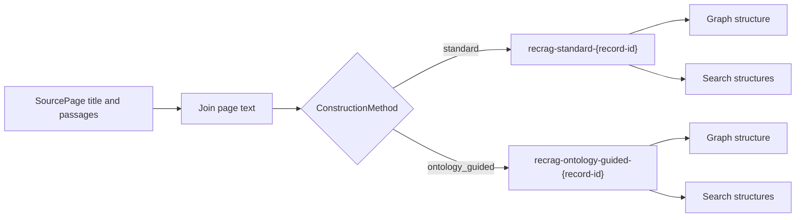
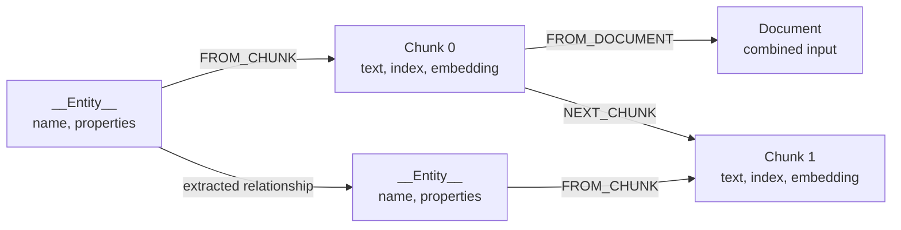
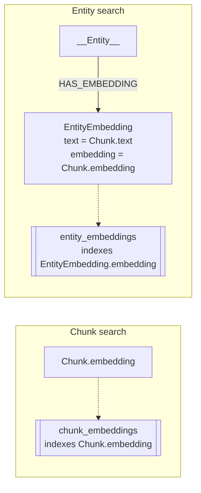
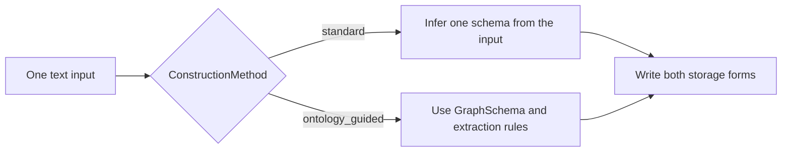

# Graph construction

Graph construction turns [`SourcePage`](../../graphrag/construction/construction.py#L28-L31)
values into Neo4j data. It has two separate choices:

- storage form, which is fixed for every run;
- construction approach, which changes the extracted graph.

For each record and construction approach, RecRAG creates one database and
writes both storage forms. The public
[`GraphRAG.construct()`](../../graphrag/graph_rag.py#L226-L241) method calls
[`rebuild_graph()`](../../graphrag/construction/construction.py#L34-L106).

The flow is the same for every dataset. Only the `SourcePage` values change.

RecRAG uses that pipeline for both construction approaches.



## Inputs and database isolation

`SourcePage` has a `title` and a list of `passages`. The construction code joins
the passages for each page with blank lines and prefixes the page with
`Page: {title}`. It then joins all pages into one input string.

In code, that transformation is:

```python
page_texts = []
passages_text = "\n\n".join(page.passages)
page_texts.append(f"Page: {page.title}\n{passages_text}")
text = "\n\n".join(page_texts)
```

Each record and construction method uses a separate Neo4j database. The
`database_name()` method creates names in this form:

```text
recrag-{construction-method}-{record-id}
```

For example, `ontology_guided` becomes `ontology-guided` in the database name.
The retrieval methods later query the database built for the selected
construction method.

## Storage forms

Each record and construction method uses a separate Neo4j database. Both
storage forms below are stored in that same database.

### Graph structure

The pipeline stores one `Document` node for the combined input, one `Chunk`
node per text chunk, and `__Entity__` nodes for extracted entities. It stores
the source page titles and passages in `Chunk.text`; it does not create a node
for each `SourcePage`.



The `FROM_CHUNK`, `FROM_DOCUMENT`, and `NEXT_CHUNK` edges preserve source
structure. The entity-to-entity edge stores an extracted fact, such as
`BORN_IN`.

### Search structures

The construction code stores chunk embeddings on `Chunk` nodes and indexes them
with `chunk_embeddings`. It also creates one `EntityEmbedding` node for each
entity-to-chunk link that has a chunk embedding. It copies the linked chunk's
text and embedding into that node, connects it to the entity with
`HAS_EMBEDDING`, and indexes it with `entity_embeddings`.



The solid arrow is a Neo4j relationship. The dotted arrows point to Neo4j
indexes; indexes are database structures, not graph nodes.

## Construction approaches

[`ConstructionMethod`](../../graphrag/construction/construction.py#L20-L25) has
two values. Each approach writes the same two storage forms. `rebuild_graph()`
selects the matching module and uses its `SCHEMA` and `EXTRACTION_PROMPT` to
decide which nodes, properties, and relationships to write.



### Standard extraction

The [`standard` implementation](../../graphrag/construction/default_extraction.py#L1-L6)
sets `SCHEMA = None` and uses
`ERExtractionTemplate.DEFAULT_TEMPLATE` without local changes.

In this approach, `SimpleKGPipeline` infers one guiding schema from the input
text and uses it for extraction across all chunks. The schema determines the
node labels, relationship types, and properties. See
Neo4j's [schema parameter behavior](https://neo4j.com/docs/neo4j-graphrag-python/current/user_guide_kg_builder.html#schema-parameter-behavior).

### Ontology-guided extraction

The [`ontology_guided` implementation](../../graphrag/construction/ontology_guided.py#L11-L169)
passes a `GraphSchema` with named node labels, relationship types, and node
properties to the pipeline.

The schema lists these node labels:
`Person`, `Organization`, `Place`, `CreativeWork`, `Event`, `Concept`, and
`Thing`. It lists these relationship types:
`BORN_IN`, `DIED_IN`, `LOCATED_IN`, `PART_OF`, `MEMBER_OF`, `CREATED_BY`,
`SPOUSE_OF`, `CHILD_OF`, `AWARDED`, and `HAS_NATIONALITY`.

The schema allows additional node labels and relationship types. The prompt
also requires every node to have a name, keeps properties grounded in the
source text, uses `Thing` only as a fallback, and writes short uppercase
snake-case relationship names. It tells the extractor to put one fact in each
relationship and not add facts that the source does not state.
See Neo4j's [`GraphSchema` reference](https://neo4j.com/docs/neo4j-graphrag-python/current/types.html#graphschema).

## Write order and indexes

[`rebuild_graph()`](../../graphrag/construction/construction.py#L34-L106) writes
both storage forms in this order:

1. It creates the Neo4j database for the record and construction approach.
2. `SimpleKGPipeline` writes the `Document`, `Chunk`, `__Entity__`, and
   extracted relationship data.
3. The construction code copies each linked chunk's text and embedding into
   `EntityEmbedding` nodes and connects them with `HAS_EMBEDDING`.
4. It creates these indexes:

| Index | Neo4j label | Indexed property | Search type |
| --- | --- | --- | --- |
| `chunk_embeddings` | `Chunk` | `embedding` | Cosine vector search with the configured embedding dimensions. |
| `entity_embeddings` | `EntityEmbedding` | `embedding` | Cosine vector search for linked entities. |

The code waits for both indexes with `CALL db.awaitIndexes(60)` before the
database is ready for retrieval.

See the [retrieval reference](retrieval.md) for how the graph and indexes are
queried. See the [evaluation reference](evals.md) for the checks that run after
construction.

## Neo4j documentation

- [Knowledge Graph Builder guide](https://neo4j.com/docs/neo4j-graphrag-python/current/user_guide_kg_builder.html)
- [`SimpleKGPipeline` API reference](https://neo4j.com/docs/neo4j-graphrag-python/current/api.html#neo4j_graphrag.experimental.pipeline.kg_builder.SimpleKGPipeline)
- [`GraphSchema`, `NodeType`, and `RelationshipType` types](https://neo4j.com/docs/neo4j-graphrag-python/current/types.html)
