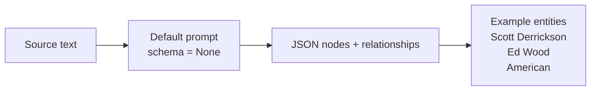
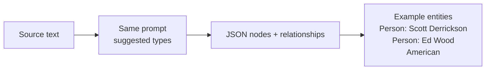
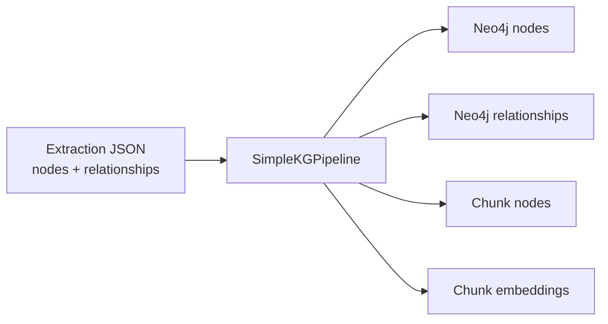
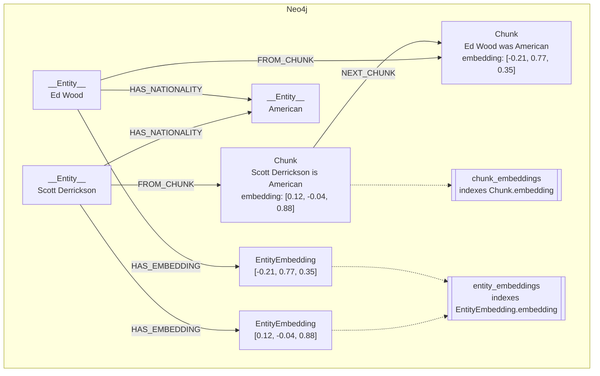
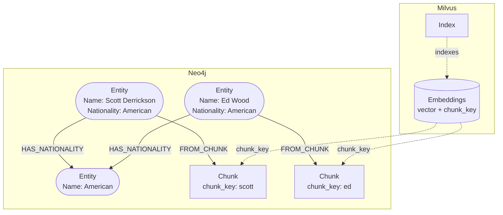

# Graph construction

Graph construction turns source pages into extracted entities, relationships,
text chunks, and embeddings.

## The whole flow

Both methods receive source pages. They differ in the prompt and schema passed
to the extractor.

```mermaid
flowchart LR
    input["Source pages"] --> method{"Extraction method"}
    method --> standard["Standard<br/>extract with no schema"]
    method --> guided["Ontology-guided<br/>extract with suggested types"]
    standard --> extracted["Extraction JSON<br/>nodes + relationships"]
    guided --> extracted
    extracted --> pipeline["SimpleKGPipeline<br/>builds the graph"]
    pipeline --> graph["Graph + chunks<br/>and embeddings"]
    graph --> storage{"Storage"}
    storage --> neo4j["Neo4j<br/>graph + embeddings"]
    storage --> split["Neo4j graph<br/>Milvus embeddings"]
```

## One example

The question is used later for retrieval and evaluation. Construction receives
only the source pages.

```text
Question (not construction input):
Were Scott Derrickson and Ed Wood of the same nationality?

Source pages:
Scott Derrickson was an American director, screenwriter, and producer.
Ed Wood was an American filmmaker, actor, writer, producer, and director.
```

### Approach 1: Standard

Standard passes `SCHEMA = None` and the default extraction prompt.



### Approach 2: Ontology-guided

Ontology-guided passes suggested node and relationship types. It can return
additional types.



The diagrams show the extraction stage, not the exact output for every run.

## Prompts sent to the extractor

Both methods use this prompt. `SimpleKGPipeline` fills `{schema}`, `{examples}`,
and `{text}`.

```text
You are a top-tier algorithm designed for extracting
information in structured formats to build a knowledge graph.

Extract the entities (nodes) and specify their type from the following text.
Also extract the relationships between these nodes.

Return result as JSON using the following format:
{{"nodes": [ {{"id": "0", "label": "Person", "properties": {{"name": "John"}} }}],
"relationships": [{{"type": "KNOWS", "start_node_id": "0", "end_node_id": "1", "properties": {{"since": "2024-08-01"}} }}] }}

Use only the following node and relationship types (if provided):
{schema}

Assign a unique ID (string) to each node, and reuse it to define relationships.
Do respect the source and target node types for relationship and
the relationship direction.

Make sure you adhere to the following rules to produce valid JSON objects:
- Do not return any additional information other than the JSON in it.
- Omit any backticks around the JSON - simply output the JSON on its own.
- The JSON object must not wrapped into a list - it is its own JSON object.
- Property names must be enclosed in double quotes

Examples:
{examples}

Input text:

{text}
```

The Standard method passes `SCHEMA = None`. The Ontology-guided method passes
these suggested types through `{schema}`:

```text
Node types:
Person, Organization, Place, CreativeWork, Event, Concept, Thing

Relationship types:
BORN_IN, DIED_IN, LOCATED_IN, PART_OF, MEMBER_OF, CREATED_BY,
SPOUSE_OF, CHILD_OF, AWARDED, HAS_NATIONALITY

Additional node and relationship types: allowed
```

The Ontology-guided method appends these rules to the shared prompt:

```text
Rules:
- Every node needs a name.
- Fill a field only when text states it. Omit it when not stated.
- Use Thing only when no narrower kind fits.
- Link name is UPPER_SNAKE, short, from text.
- One fact per link. No facts outside text.
```

## Build the graph



## Storage option 1: Neo4j for the graph and embeddings

Neo4j can store the extracted graph and the vectors used to search its chunks.
The vectors below are shortened examples.



The active construction code creates a database for each run, record, and
construction method. It stops if extraction or graph writing fails. Successful
runs copy chunk embeddings for entity search and build both vector indexes.

## Storage option 2: Milvus for embeddings, Neo4j for the graph

Keep the same `chunk_key` in both systems. Milvus returns that key after a
vector search. The key lets the application fetch the matching chunk and its
connected entities from Neo4j.



The link between Milvus and Neo4j is the shared `chunk_key`. Milvus does not
store the graph.

The repository does not currently implement this ClassicalRAG path. The
diagram shows the planned split-storage comparison.

## Related docs

- [Graph retrieval](retrieval.md)
- [GraphRAG evaluation](evaluation.md)
- [Dataset records](../benchmark.md)
- [Neo4j knowledge graph builder guide](https://neo4j.com/docs/neo4j-graphrag-python/current/user_guide_kg_builder.html)
- [Neo4j vector indexes](https://neo4j.com/docs/cypher-manual/current/indexes/semantic-indexes/vector-indexes/)
