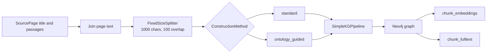

# Graph construction

Graph construction turns `SourcePage` values into a graph and two search
indexes in Neo4j. `GraphRAG.construct()` calls `rebuild_graph()` in
[`graphrag/construction/construction.py`](../../graphrag/construction/construction.py).



## Inputs and database isolation

`SourcePage` has a `title` and a list of `passages`. The construction code joins
the passages for each page with blank lines and prefixes the page with
`Page: {title}`. It then joins all pages into one input string.

Each record and construction method uses a separate Neo4j database. The
`database_name()` method creates names in this form:

```text
recrag-{construction-method}-{record-id}
```

For example, `ontology_guided` becomes `ontology-guided` in the database name.
The retrieval methods later query the database built for the selected
construction method.

## Construction methods

The method is a `ConstructionMethod` enum with two values:

| Method | Schema and prompt | What the extractor can produce |
| --- | --- | --- |
| `standard` | `SCHEMA = None` and `ERExtractionTemplate.DEFAULT_TEMPLATE` | The default `neo4j-graphrag` schema and extraction behavior. |
| `ontology_guided` | A fixed `GraphSchema` plus extraction rules | Fixed top-level kinds and relationship names, with additional kinds and relationships allowed. |

The ontology-guided schema names these top-level node kinds:
`Person`, `Organization`, `Place`, `CreativeWork`, `Event`, `Concept`, and
`Thing`.

It names these relationship types:
`BORN_IN`, `DIED_IN`, `LOCATED_IN`, `PART_OF`, `MEMBER_OF`, `CREATED_BY`,
`SPOUSE_OF`, `CHILD_OF`, `AWARDED`, and `HAS_NATIONALITY`.

The ontology-guided prompt adds these rules:

- Every node needs a name.
- Fill a field only when the text states it.
- Use `Thing` only when no narrower kind fits.
- Use short, uppercase snake-case relationship names from the text.
- Put one fact in each relationship and do not add facts outside the text.

## Pipeline and indexes

`rebuild_graph()` selects the module for the requested method and creates a
`SimpleKGPipeline` with these settings:

- the `GraphRAGChatLLM` adapter around the configured `ChatOpenAI` model;
- the configured OpenAI embedder;
- the selected schema and extraction prompt;
- `from_file=False`;
- a `FixedSizeSplitter` with a 1,000-character chunk size and 100-character overlap;
- the selected Neo4j database.

The pipeline writes chunk and entity data to Neo4j. The code then creates:

| Index | Neo4j label | Indexed property | Search type |
| --- | --- | --- | --- |
| `chunk_embeddings` | `Chunk` | `embedding` | Cosine vector search with the configured embedding dimensions. |
| `chunk_fulltext` | `Chunk` | `text` | Full-text search. |

The code waits for both indexes with `CALL db.awaitIndexes(60)` before the
database is ready for retrieval.

## Configuration used by construction

`GraphRAG.from_config()` reads non-secret settings from `config.toml` and
credentials from `.env`. The current configuration uses `gpt-5.6-luna` with
medium reasoning effort for the LLM adapter and `text-embedding-3-small` for
embeddings. Generation uses the OpenAI Responses API.

See the [retrieval reference](retrieval.md) for how the graph and indexes are
queried. See the [evaluation reference](evals.md) for the checks that run after
construction.
