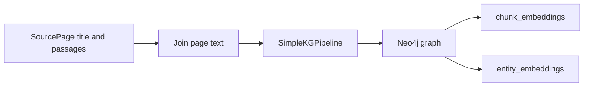
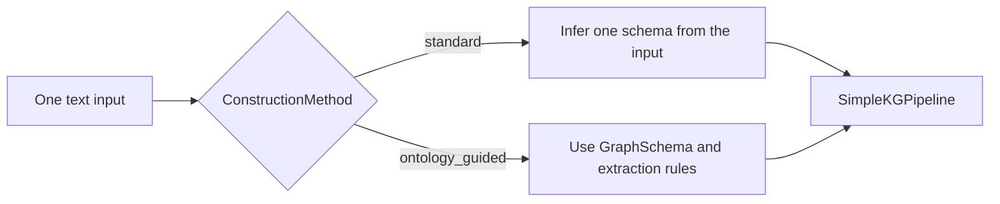

# Graph construction

Graph construction turns [`SourcePage`](../../graphrag/construction/construction.py#L28-L31)
values into a graph and two vector indexes in Neo4j. The public
[`GraphRAG.construct()`](../../graphrag/graph_rag.py#L226-L241) method calls
[`rebuild_graph()`](../../graphrag/construction/construction.py#L34-L106).

The flow is the same for every dataset. Only the `SourcePage` values change.

RecRAG uses that pipeline for both construction approaches.



## Inputs and database isolation

`SourcePage` has a `title` and a list of `passages`. The construction code joins
the passages for each page with blank lines and prefixes the page with
`Page: {title}`. It then joins all pages into one input string.

In code, that transformation is:

```python
page_texts = []
passages_text = "\n\n".join(page.passages)
page_texts.append(f"Page: {page.title}\n{passages_text}")
text = "\n\n".join(page_texts)
```

Each record and construction method uses a separate Neo4j database. The
`database_name()` method creates names in this form:

```text
recrag-{construction-method}-{record-id}
```

For example, `ontology_guided` becomes `ontology-guided` in the database name.
The retrieval methods later query the database built for the selected
construction method.

## Construction approaches

[`ConstructionMethod`](../../graphrag/construction/construction.py#L20-L25) has
two values. `rebuild_graph()` selects the matching module and passes that
module's `SCHEMA` and `EXTRACTION_PROMPT` to `SimpleKGPipeline`.



### Standard extraction

The [`standard` implementation](../../graphrag/construction/default_extraction.py#L1-L6)
sets `SCHEMA = None` and uses
`ERExtractionTemplate.DEFAULT_TEMPLATE` without local changes.

In this approach, `SimpleKGPipeline` infers one guiding schema from the input
text and uses it for extraction across all chunks. The model chooses the node
labels, relationship types, and properties from that inferred schema. See
Neo4j's [schema parameter behavior](https://neo4j.com/docs/neo4j-graphrag-python/current/user_guide_kg_builder.html#schema-parameter-behavior).

### Ontology-guided extraction

The [`ontology_guided` implementation](../../graphrag/construction/ontology_guided.py#L11-L169)
passes a `GraphSchema` with named node labels, relationship types, and node
properties to the pipeline.

The schema lists these node labels:
`Person`, `Organization`, `Place`, `CreativeWork`, `Event`, `Concept`, and
`Thing`. It lists these relationship types:
`BORN_IN`, `DIED_IN`, `LOCATED_IN`, `PART_OF`, `MEMBER_OF`, `CREATED_BY`,
`SPOUSE_OF`, `CHILD_OF`, `AWARDED`, and `HAS_NATIONALITY`.

The schema allows additional node labels and relationship types. The prompt
also requires every node to have a name, keeps properties grounded in the
source text, uses `Thing` only as a fallback, and writes short uppercase
snake-case relationship names. It tells the extractor to put one fact in each
relationship and not add facts that the source does not state.
See Neo4j's [`GraphSchema` reference](https://neo4j.com/docs/neo4j-graphrag-python/current/types.html#graphschema).

## Pipeline and indexes

[`rebuild_graph()`](../../graphrag/construction/construction.py#L34-L106)
selects the module for the requested method and creates a `SimpleKGPipeline`
with these settings:

- the `GraphRAGChatLLM` adapter around the configured `ChatOpenAI` model;
- the configured OpenAI embedder;
- the selected schema and extraction prompt;
- `from_file=False`;
- a `FixedSizeSplitter` with a 1,000-character chunk size and 100-character overlap;
- the selected Neo4j database.

The pipeline writes graph and chunk data to Neo4j. The construction code copies
each linked chunk's text and embedding into `EntityEmbedding` nodes. It then
creates these indexes:

| Index | Neo4j label | Indexed property | Search type |
| --- | --- | --- | --- |
| `chunk_embeddings` | `Chunk` | `embedding` | Cosine vector search with the configured embedding dimensions. |
| `entity_embeddings` | `EntityEmbedding` | `embedding` | Cosine vector search for linked entities. |

The code waits for both indexes with `CALL db.awaitIndexes(60)` before the
database is ready for retrieval.

## Configuration used by construction

`GraphRAG.from_config()` reads non-secret settings from `config.toml` and
credentials from `.env`. The current configuration uses `gpt-5.6-luna` with
medium reasoning effort for the LLM adapter and `text-embedding-3-small` for
embeddings. Generation uses the OpenAI Responses API.

See the [retrieval reference](retrieval.md) for how the graph and indexes are
queried. See the [evaluation reference](evals.md) for the checks that run after
construction.

## Neo4j documentation

- [Knowledge Graph Builder guide](https://neo4j.com/docs/neo4j-graphrag-python/current/user_guide_kg_builder.html)
- [`SimpleKGPipeline` API reference](https://neo4j.com/docs/neo4j-graphrag-python/current/api.html#neo4j_graphrag.experimental.pipeline.kg_builder.SimpleKGPipeline)
- [`GraphSchema`, `NodeType`, and `RelationshipType` types](https://neo4j.com/docs/neo4j-graphrag-python/current/types.html)
