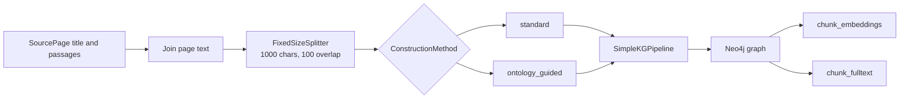

# Graph construction

Graph construction turns [`SourcePage`](../../graphrag/construction/construction.py#L26-L29)
values into a graph and two search indexes in Neo4j. The public
[`GraphRAG.construct()`](../../graphrag/graph_rag.py#L162-L177) method calls
[`rebuild_graph()`](../../graphrag/construction/construction.py#L32-L89).

Neo4j describes `SimpleKGPipeline` as "A class to simplify the process of
building a knowledge graph from text documents" in its
[API reference](https://neo4j.com/docs/neo4j-graphrag-python/current/api.html#neo4j_graphrag.experimental.pipeline.kg_builder.SimpleKGPipeline).
RecRAG uses that pipeline for both construction approaches.



## Inputs and database isolation

`SourcePage` has a `title` and a list of `passages`. The construction code joins
the passages for each page with blank lines and prefixes the page with
`Page: {title}`. It then joins all pages into one input string.

Each record and construction method uses a separate Neo4j database. The
`database_name()` method creates names in this form:

```text
recrag-{construction-method}-{record-id}
```

For example, `ontology_guided` becomes `ontology-guided` in the database name.
The retrieval methods later query the database built for the selected
construction method.

## Construction approaches

[`ConstructionMethod`](../../graphrag/construction/construction.py#L18-L24) has
two values. `rebuild_graph()` selects the matching module and passes that
module's `SCHEMA` and `EXTRACTION_PROMPT` to `SimpleKGPipeline`.

### Standard extraction

The [`standard` implementation](../../graphrag/construction/default_extraction.py#L1-L6)
sets `SCHEMA = None` and uses
`ERExtractionTemplate.DEFAULT_TEMPLATE` without local changes.

> "The schema is automatically extracted from the input text once using LLM."
>
> [Neo4j schema parameter behavior](https://neo4j.com/docs/neo4j-graphrag-python/current/user_guide_kg_builder.html#schema-parameter-behavior)

In this approach, `SimpleKGPipeline` infers one guiding schema from the input
text and uses it for extraction across all chunks. The model chooses the node
labels, relationship types, and properties from that inferred schema.

### Ontology-guided extraction

The [`ontology_guided` implementation](../../graphrag/construction/ontology_guided.py#L1-L39)
passes a `GraphSchema` with named node labels, relationship types, and node
properties to the pipeline.

> "It is used both for guiding the LLM in the entity and relation extraction component, and for cleaning the extracted graph in a post-processing step."
>
> [Neo4j `GraphSchema` reference](https://neo4j.com/docs/neo4j-graphrag-python/current/types.html#graphschema)

The schema lists these node labels:
`Person`, `Organization`, `Place`, `CreativeWork`, `Event`, `Concept`, and
`Thing`. It lists these relationship types:
`BORN_IN`, `DIED_IN`, `LOCATED_IN`, `PART_OF`, `MEMBER_OF`, `CREATED_BY`,
`SPOUSE_OF`, `CHILD_OF`, `AWARDED`, and `HAS_NATIONALITY`.

The schema allows additional node labels and relationship types. The prompt
also requires every node to have a name, keeps properties grounded in the
source text, uses `Thing` only as a fallback, and writes short uppercase
snake-case relationship names. It tells the extractor to put one fact in each
relationship and not add facts that the source does not state.

## Pipeline and indexes

[`rebuild_graph()`](../../graphrag/construction/construction.py#L32-L89)
selects the module for the requested method and creates a `SimpleKGPipeline`
with these settings:

- the `GraphRAGChatLLM` adapter around the configured `ChatOpenAI` model;
- the configured OpenAI embedder;
- the selected schema and extraction prompt;
- `from_file=False`;
- a `FixedSizeSplitter` with a 1,000-character chunk size and 100-character overlap;
- the selected Neo4j database.

The pipeline writes chunk and entity data to Neo4j. The code then creates:

| Index | Neo4j label | Indexed property | Search type |
| --- | --- | --- | --- |
| `chunk_embeddings` | `Chunk` | `embedding` | Cosine vector search with the configured embedding dimensions. |
| `chunk_fulltext` | `Chunk` | `text` | Full-text search. |

The code waits for both indexes with `CALL db.awaitIndexes(60)` before the
database is ready for retrieval.

## Configuration used by construction

`GraphRAG.from_config()` reads non-secret settings from `config.toml` and
credentials from `.env`. The current configuration uses `gpt-5.6-luna` with
medium reasoning effort for the LLM adapter and `text-embedding-3-small` for
embeddings. Generation uses the OpenAI Responses API.

See the [retrieval reference](retrieval.md) for how the graph and indexes are
queried. See the [evaluation reference](evals.md) for the checks that run after
construction.

## Neo4j documentation

- [Knowledge Graph Builder guide](https://neo4j.com/docs/neo4j-graphrag-python/current/user_guide_kg_builder.html)
- [`SimpleKGPipeline` API reference](https://neo4j.com/docs/neo4j-graphrag-python/current/api.html#neo4j_graphrag.experimental.pipeline.kg_builder.SimpleKGPipeline)
- [`GraphSchema`, `NodeType`, and `RelationshipType` types](https://neo4j.com/docs/neo4j-graphrag-python/current/types.html)
