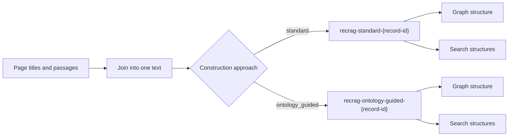
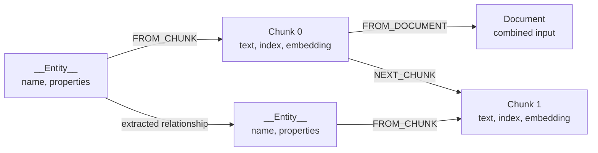
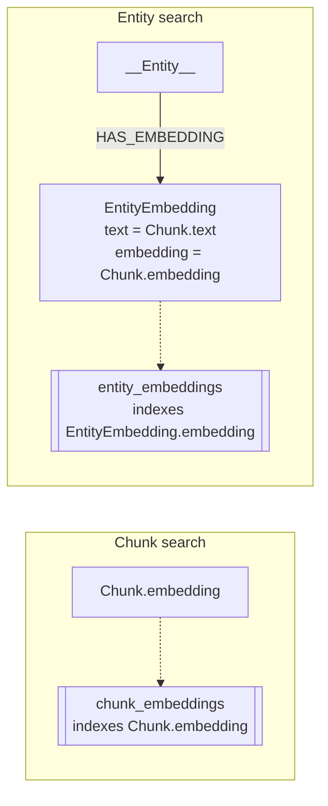
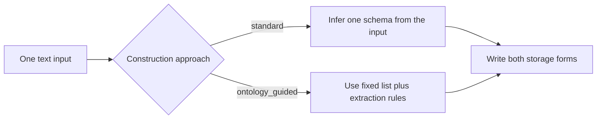

# Graph construction

Graph construction turns source text into saved graph data.
Source text means the page titles and passages for one test question.
Saved graph data means the people, places, facts, and text slices stored in Neo4j for later search.

Neo4j does not split raw text or extract entities by itself.
The Neo4j GraphRAG package provides a text splitter, an embedder, an entity and relationship extractor, and a graph writer.
Neo4j stores the nodes, relationships, and embedding properties that those components produce.

A `Chunk` is a normal Neo4j node with text, an index, and, when enabled, an embedding.
If a paragraph is shorter than the splitter limit, it can remain one `Chunk`.
Chunking does not mean that Neo4j breaks every paragraph into smaller pieces.

There are two separate choices:

- construction approach, which changes which facts get pulled out;
- storage form, which is the same shape every time.

For each test question and each approach, RecRAG creates one Neo4j database and writes both storage forms into it.
A database is one isolated store, so the two approaches never mix.



## Inputs and database isolation

A source page is one page with a title plus a list of text pieces.
For example, title `Marie Curie` with two passages about her birth and her Nobel prize.

Construction joins the input in two steps.
First it adds a `Page: {title}` header to each page and joins that page's passages with blank lines.
Then it joins all pages into one long text string.
Small example:

```text
Page: Marie Curie

She was born in Warsaw.

She won the Nobel Prize in Physics.
```

In code, that transformation is:

```python
page_texts = []
passages_text = "\n\n".join(page.passages)
page_texts.append(f"Page: {page.title}\n{passages_text}")
text = "\n\n".join(page_texts)
```

Each test question and construction approach gets its own database.
The name has this form:

```text
recrag-{construction-method}-{record-id}
```

For example, `ontology_guided` becomes `ontology-guided` in the database name.
Retrieval later reads from the database built for the selected approach.

Code map: `SourcePage` holds the title and passages.
`database_name()` builds the name above, and `GraphRAG.construct()` calls `rebuild_graph()`.

## Storage forms

Every database holds the same two storage forms below.
Storage form means how the data is saved, not which facts were found.

### Graph structure

The graph has three main node kinds.
A `Document` node holds the whole combined input.
A `Chunk` node holds one text slice, about 1,000 characters with 100 characters of overlap in this project.
Short input can produce one chunk containing the whole input.
An `__Entity__` node holds one thing found in the text, such as a person or a place, with a name and properties.

It stores the page titles and passages inside `Chunk.text`.
It does not make one node per source page, because chunks are slices of the joined text, not whole pages.



The edges keep source order, source links, and meaning.
`FROM_CHUNK` links an entity to the chunk where it was found.
`FROM_DOCUMENT` links a chunk to the whole input.
`NEXT_CHUNK` links one chunk to the next chunk.
An extracted edge, such as `BORN_IN`, stores one fact between two entities.
`FROM_CHUNK` and `BORN_IN` are different: the first points to the source text, while the second states a fact.

Code map: `SimpleKGPipeline` writes the `Document`, `Chunk`, `__Entity__`, and extracted-fact data.

### Search structures

Search needs numbers, not just words.
An embedding is a list of numbers that captures meaning, so similar texts get similar numbers.
A vector index is a fast lookup over those numbers by cosine similarity, which is a closeness score between two embeddings.

Neo4j's vector index indexes an embedding property on a node or relationship.
A vector index does not return related entities. It returns the nodes or relationships covered by that index.

Chunk search stores the embedding on each `Chunk` node and indexes it as `chunk_embeddings`.
The index returns matching chunks first.
A retrieval query can then follow `FROM_CHUNK` links to add the entities and facts connected to those chunks.

This project also has an optional entity-search path.
It copies a linked chunk's text and embedding into an `EntityEmbedding` node, links it to the entity with `HAS_EMBEDDING`, and indexes it as `entity_embeddings`.
Neo4j does not require this extra node, and the Neo4j GraphRAG documentation does not use it as the default model.
The copied embedding represents the chunk text, not the entity by itself.



The solid arrow is a Neo4j relationship.
The dotted arrows point to Neo4j indexes; indexes are database helpers, not graph nodes.

For chunk retrieval, the path is: question, question embedding, `chunk_embeddings`, matching `Chunk`, then graph links to entities and facts.
The vector index finds the text. The graph links add structure.

Code map: the copy step runs one Cypher query after the pipeline.
Then `create_vector_index()` builds both indexes.

## Construction approaches

A schema is the allowed list of node kinds, link kinds, and fields.
Each approach below writes the same two storage forms.
It only changes the schema and prompt used to decide which nodes, fields, and links to write.



### Standard extraction

Standard means no fixed list.
The model reads the input, invents one guiding schema, and reuses it across all chunks.
The schema sets the node labels, relationship types, and properties for that run.
Use this when the kinds are not known ahead of time.

It uses the default entity-relationship extraction prompt with no local changes.

Code map: the standard module sets `SCHEMA = None` and passes `ERExtractionTemplate.DEFAULT_TEMPLATE`.
See Neo4j's [schema parameter behavior](https://neo4j.com/docs/neo4j-graphrag-python/current/user_guide_kg_builder.html#schema-parameter-behavior).

### Ontology-guided extraction

Ontology-guided means a fixed starting list.
An ontology is a fixed list of allowed kinds.
The run passes named node labels, relationship types, and node fields to the pipeline, but it may still add new labels and link types when the text needs them.

The node labels are: `Person`, `Organization`, `Place`, `CreativeWork`, `Event`, `Concept`, and `Thing`.
The relationship types are: `BORN_IN`, `DIED_IN`, `LOCATED_IN`, `PART_OF`, `MEMBER_OF`, `CREATED_BY`, `SPOUSE_OF`, `CHILD_OF`, `AWARDED`, and `HAS_NATIONALITY`.

The prompt adds these rules.
Every node needs a name.
Fill a field only when the text states it.
Use `Thing` only when no narrower kind fits.
Keep link names short and uppercase with underscores.
Put one fact in each link, and add no facts outside the text.

Code map: the ontology-guided module passes a `GraphSchema` plus an extended prompt.
See Neo4j's [`GraphSchema` reference](https://neo4j.com/docs/neo4j-graphrag-python/current/types.html#graphschema).

## Write order and indexes

Both storage forms are written in this order:

1. Create the Neo4j database for the test question and approach.
2. Write the `Document`, `Chunk`, `__Entity__`, and extracted-fact data.
3. Copy each linked chunk's text and embedding into `EntityEmbedding` nodes and link them with `HAS_EMBEDDING`.
4. Build these indexes:

| Index | Neo4j label | Indexed property | Search type |
| --- | --- | --- | --- |
| `chunk_embeddings` | `Chunk` | `embedding` | Cosine vector search with the configured embedding dimensions. |
| `entity_embeddings` | `EntityEmbedding` | `embedding` | Cosine vector search over chunk text copied for an entity link. |

The code then waits for both indexes with `CALL db.awaitIndexes(60)`.
That call blocks up to 60 seconds until the indexes are ready, so the database is ready for retrieval after it returns.

Code map: `rebuild_graph()` does all four steps in order.

See the [retrieval reference](retrieval.md) for how the graph and indexes are queried.
See the [evaluation reference](evals.md) for the checks that run after construction.

## Neo4j documentation

- [Knowledge Graph Builder guide](https://neo4j.com/docs/neo4j-graphrag-python/current/user_guide_kg_builder.html)
- [`SimpleKGPipeline` API reference](https://neo4j.com/docs/neo4j-graphrag-python/current/api.html#neo4j_graphrag.experimental.pipeline.kg_builder.SimpleKGPipeline)
- [`GraphSchema`, `NodeType`, and `RelationshipType` types](https://neo4j.com/docs/neo4j-graphrag-python/current/types.html)
- [Vector indexes](https://neo4j.com/docs/cypher-manual/current/indexes/semantic-indexes/vector-indexes/)
- [Embeddings and vector indexes tutorial](https://neo4j.com/docs/genai/tutorials/current/embeddings-vector-indexes/)
