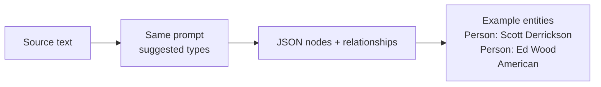
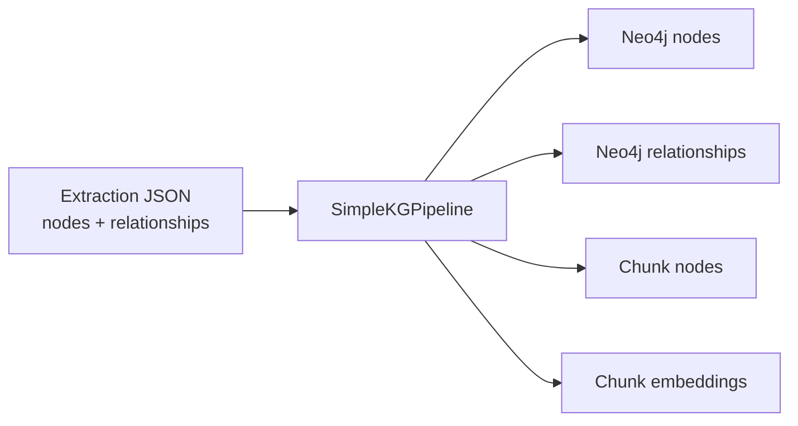
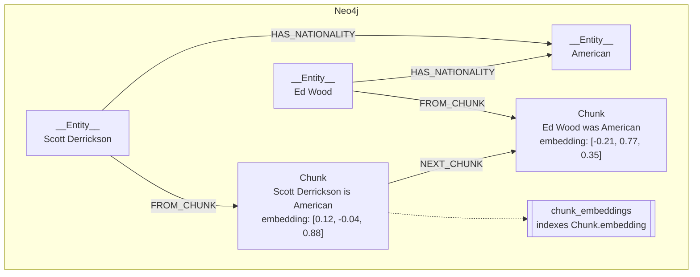

# Graph construction

Graph construction turns source pages into extracted entities, relationships,
text chunks, and embeddings.

## The whole flow

Ontology-guided construction receives source pages and passes the ontology
schema and prompt to the extractor.

```mermaid
flowchart LR
    input["Source pages"] --> guided["Ontology-guided<br/>extract with suggested types"]
    guided --> extracted["Extraction JSON<br/>nodes + relationships"]
    extracted --> pipeline["SimpleKGPipeline<br/>builds the graph"]
    pipeline --> graph["Graph + chunks<br/>and embeddings"]
    graph --> neo4j["Neo4j<br/>graph + vectors"]
```

## One example

The question is used later for retrieval and evaluation. Construction receives
only the source pages.

```text
Question (not construction input):
Were Scott Derrickson and Ed Wood of the same nationality?

Source pages:
Scott Derrickson was an American director, screenwriter, and producer.
Ed Wood was an American filmmaker, actor, writer, producer, and director.
```

### Ontology-guided extraction

Ontology-guided passes suggested node and relationship types. It can return
additional types.


```mermaid
graph LR
    text["Source text"] --> extract["Same prompt<br/>suggested types"]
    extract --> output["JSON nodes + relationships"]
    output --> entities["Example entities<br/>Person: Scott Derrickson<br/>Person: Ed Wood<br/>American"]
```

The diagrams show the extraction stage, not the exact output for every run.

## Prompts sent to the extractor

Ontology-guided extraction starts with this prompt. `SimpleKGPipeline` fills `{schema}`, `{examples}`,
and `{text}`.

```text
You are a top-tier algorithm designed for extracting
information in structured formats to build a knowledge graph.

Extract the entities (nodes) and specify their type from the following text.
Also extract the relationships between these nodes.

Return result as JSON using the following format:
{{"nodes": [ {{"id": "0", "label": "Person", "properties": {{"name": "John"}} }}],
"relationships": [{{"type": "KNOWS", "start_node_id": "0", "end_node_id": "1", "properties": {{"since": "2024-08-01"}} }}] }}

Use only the following node and relationship types (if provided):
{schema}

Assign a unique ID (string) to each node, and reuse it to define relationships.
Do respect the source and target node types for relationship and
the relationship direction.

Make sure you adhere to the following rules to produce valid JSON objects:
- Do not return any additional information other than the JSON in it.
- Omit any backticks around the JSON - simply output the JSON on its own.
- The JSON object must not wrapped into a list - it is its own JSON object.
- Property names must be enclosed in double quotes

Examples:
{examples}

Input text:

{text}
```

The ontology passes these suggested types through `{schema}`:

```text
Node types:
Person, Organization, Place, CreativeWork, Event, Concept, Thing

Relationship types:
BORN_IN, DIED_IN, LOCATED_IN, PART_OF, MEMBER_OF, CREATED_BY,
SPOUSE_OF, CHILD_OF, AWARDED, HAS_NATIONALITY

Additional node and relationship types: allowed
```

The Ontology-guided method appends these rules to the shared prompt:

```text
Rules:
- Every node needs a name.
- Fill a field only when text states it. Omit it when not stated.
- Use Thing only when no narrower kind fits.
- Link name is UPPER_SNAKE, short, from text.
- One fact per link. No facts outside text.
```

## Build the graph


```mermaid
flowchart LR
    extracted["Extraction JSON<br/>nodes + relationships"] --> pipeline["SimpleKGPipeline"]
    pipeline --> nodes["Neo4j nodes"]
    pipeline --> relationships["Neo4j relationships"]
    pipeline --> chunks["Chunk nodes"]
    pipeline --> embeddings["Chunk embeddings"]
```

## Neo4j graph and vector storage

Neo4j can store the extracted graph and the vectors used to search its chunks.
The vectors below are shortened examples.


```mermaid
graph TD
    subgraph NEO4J["Neo4j"]
        chunk1["Chunk<br/>Scott Derrickson is American<br/>embedding: [0.12, -0.04, 0.88]"]
        chunk2["Chunk<br/>Ed Wood was American<br/>embedding: [-0.21, 0.77, 0.35]"]
        scott["__Entity__<br/>Scott Derrickson"]
        ed["__Entity__<br/>Ed Wood"]
        american["__Entity__<br/>American"]
        chunk_index[["chunk_embeddings<br/>indexes Chunk.embedding"]]

        scott -->|HAS_NATIONALITY| american
        ed -->|HAS_NATIONALITY| american
        scott -->|FROM_CHUNK| chunk1
        ed -->|FROM_CHUNK| chunk2
        chunk1 -->|NEXT_CHUNK| chunk2
        chunk1 -.-> chunk_index
    end
```

The active construction path creates a Neo4j database per run and source
corpus. HotpotQA questions share the loaded corpus; other datasets use each
record's source pages. Each database stores chunk vectors in Neo4j. The
`chunk_embeddings` index supports the agent's vector tool.

Neo4j provides both vector search and graph context for agentic retrieval.

## Related docs

- [Graph retrieval](retrieval.md)
- [GraphRAG evaluation](evaluation.md)
- [Dataset records](../benchmark.md)
- [Neo4j knowledge graph builder guide](https://neo4j.com/docs/neo4j-graphrag-python/current/user_guide_kg_builder.html)
- [Neo4j vector indexes](https://neo4j.com/docs/cypher-manual/current/indexes/semantic-indexes/vector-indexes/)
