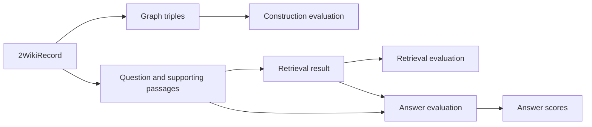

# GraphRAG evaluations

The evaluation code scores three points in the GraphRAG flow. It checks the
constructed graph, the context returned for a question, and the final answer.



## Evaluation inputs

The dataset loader creates a `TwoWikiRecord` from `dev.json`. The record keeps
the question, source pages, expected answer, answer ID, supporting facts, and
dataset evidence fields.

The evaluators use these record values as follows:

| Input | Used by |
| --- | --- |
| All source page passages | Construction groundedness and completeness. |
| Supporting passages | Construction supporting-evidence coverage and answer evaluation context. |
| Question | Retrieval and answer evaluation. |
| Expected answer and aliases | Answer correctness and deterministic alias matching. |

`supporting_sentences()` resolves the supporting page names and passage indexes
into the original source text. The construction evaluator does not use the
dataset's gold evidence triples.

## Construction evaluation

`read_entity_triples()` reads every relationship between `__Entity__` nodes and
represents each relationship as:

```text
(subject, relationship, object)
```

`evaluate_construction()` sends the graph and source context to three DeepEval
`GEval` metrics:

| Metric | Checks |
| --- | --- |
| `groundedness` | Whether the graph facts are supported by the supplied source pages, including entity identity, relationship meaning, and direction. |
| `completeness` | How much factual information from all supplied source pages the graph represents. |
| `supporting_evidence_coverage` | How much information from the record's supporting passages the graph represents. |

The evaluator also records graph statistics when the app supplies them:

- entity count;
- relationship count;
- relationship type count;
- isolated entity count;
- duplicate entity name groups;
- duplicate entity nodes;
- self-loop count.

These counts describe graph shape. They do not change the three construction
scores.

## Retrieval evaluation

`evaluate_retrieval()` checks the first five returned items by default. It puts
the question in `input`, the supporting sentences in `expected_output`, and
the selected items in `retrieval_context`.

| Metric | Checks |
| --- | --- |
| `contextual_precision` | Whether useful items appear near the top of the ranked context. |
| `contextual_recall` | Whether the returned context contains the required supporting information. |
| `contextual_relevancy` | Whether the returned context relates to the question. |

The `top_k` value is recorded in each retrieval evaluation result.

## Answer evaluation

`evaluate_answer()` passes every item returned by the retriever to the answer
evaluator. It also passes the dataset's supporting sentences as the reference
context.

The evaluator records the expected answer, answer ID, generated answer, and a
deterministic alias check. The alias check normalizes case and punctuation, then
requires the full generated answer to equal the expected answer or one accepted
alias. A longer answer can be correct and still fail this check.

DeepEval adds these checks:

| Metric or check | Checks |
| --- | --- |
| `faithfulness` | Whether the answer claims follow the context returned by retrieval. The evaluator skips the score when retrieval returns no items. |
| `relevancy` | Whether the answer addresses the question. |
| `correctness` | Whether the answer matches the expected answer or an accepted alias and has no contradiction or missing part. |
| `alias_match` | The deterministic full-answer match described above. |

Answer faithfulness uses the runtime `retrieval_context`. It does not replace
that context with the dataset's supporting passages.

## Judge model and score rules

`ResponsesOpenAIModel` wraps LangChain's `ChatOpenAI` with
`use_responses_api=True`. The current configuration uses `gpt-5.6-luna` with
medium reasoning effort for evaluation judges. All DeepEval metrics use
`threshold=None`, so the app records scores and reasons without applying a
pass or fail threshold.

The app does not combine graph, retrieval, and answer scores into one number.
The current evaluators also do not measure exact graph triple recall, exact
multi-hop path accuracy, latency, token cost, or agent tool choice.

See the [2WikiMultiHopQA results](2wikimultihop.md) for saved experiment
tables. See the [construction reference](construction.md) and
[retrieval reference](retrieval.md) for the code paths that produce the values
being evaluated.
