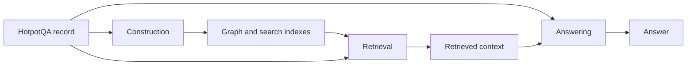
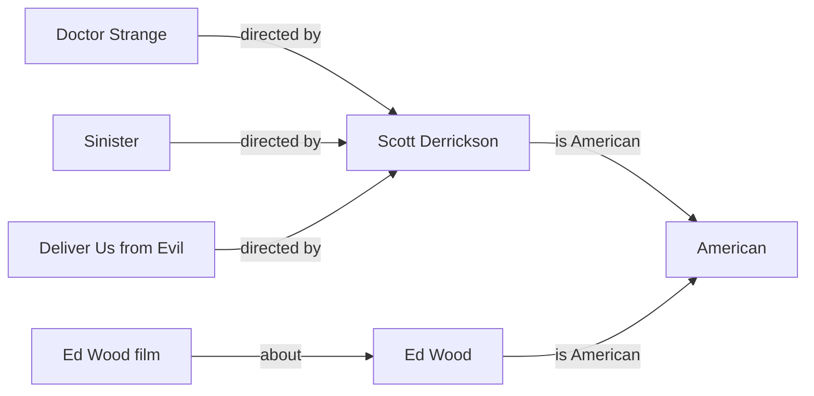
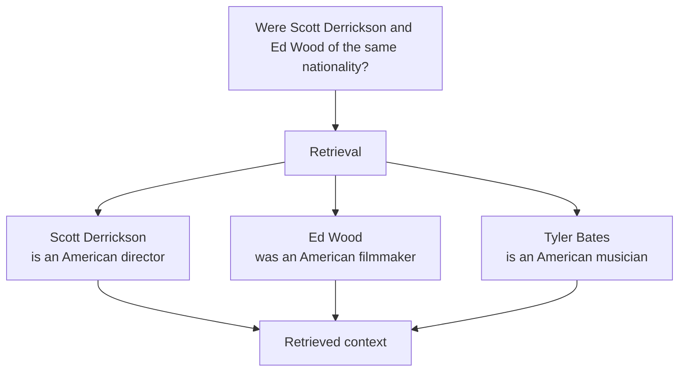
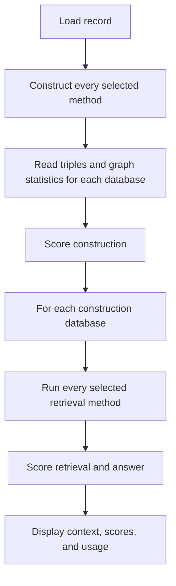

# GraphRAG evaluation

GraphRAG has three stages:

1. **Construction** turns the source pages into a graph and search indexes.
2. **Retrieval** selects context for a question from that graph.
3. **Answering** uses the question and retrieved context to produce an answer.

The same record runs through all three stages:



This page uses one complete HotpotQA record to show the input, output, and
evaluation for each stage.

## Example record

- Dataset: HotpotQA
- File: `datasets/hotpotqa/distractor-validation.parquet`
- Record ID: `5a8b57f25542995d1e6f1371`
- Question: `Were Scott Derrickson and Ed Wood of the same nationality?`
- Answer: `yes`
- Type: `comparison`
- Level: `hard`
- Supporting facts: `Scott Derrickson`, sentence `0`; `Ed Wood`, sentence `0`

The complete record is below. The `context.title` and `context.sentences`
arrays use matching positions. The first title owns the first sentence array.

```json
{
  "id": "5a8b57f25542995d1e6f1371",
  "question": "Were Scott Derrickson and Ed Wood of the same nationality?",
  "answer": "yes",
  "type": "comparison",
  "level": "hard",
  "context": {
    "title": [
      "Ed Wood (film)",
      "Scott Derrickson",
      "Woodson, Arkansas",
      "Tyler Bates",
      "Ed Wood",
      "Deliver Us from Evil (2014 film)",
      "Adam Collis",
      "Sinister (film)",
      "Conrad Brooks",
      "Doctor Strange (2016 film)"
    ],
    "sentences": [
      [
        "Ed Wood is a 1994 American biographical period comedy-drama film directed and produced by Tim Burton, and starring Johnny Depp as cult filmmaker Ed Wood.",
        " The film concerns the period in Wood's life when he made his best-known films as well as his relationship with actor Bela Lugosi, played by Martin Landau.",
        " Sarah Jessica Parker, Patricia Arquette, Jeffrey Jones, Lisa Marie, and Bill Murray are among the supporting cast."
      ],
      [
        "Scott Derrickson (born July 16, 1966) is an American director, screenwriter and producer.",
        " He lives in Los Angeles, California.",
        " He is best known for directing horror films such as \"Sinister\", \"The Exorcism of Emily Rose\", and \"Deliver Us From Evil\", as well as the 2016 Marvel Cinematic Universe installment, \"Doctor Strange.\""
      ],
      [
        "Woodson is a census-designated place (CDP) in Pulaski County, Arkansas, in the United States.",
        " Its population was 403 at the 2010 census.",
        " It is part of the Little Rock–North Little Rock–Conway Metropolitan Statistical Area.",
        " Woodson and its accompanying Woodson Lake and Wood Hollow are the namesake for Ed Wood Sr., a prominent plantation owner, trader, and businessman at the turn of the 20th century.",
        " Woodson is adjacent to the Wood Plantation, the largest of the plantations own by Ed Wood Sr."
      ],
      [
        "Tyler Bates (born June 5, 1965) is an American musician, music producer, and composer for films, television, and video games.",
        " Much of his work is in the action and horror film genres, with films like \"Dawn of the Dead, 300, Sucker Punch,\" and \"John Wick.\"",
        " He has collaborated with directors like Zack Snyder, Rob Zombie, Neil Marshall, William Friedkin, Scott Derrickson, and James Gunn.",
        " With Gunn, he has scored every one of the director's films; including \"Guardians of the Galaxy\", which became one of the highest grossing domestic movies of 2014, and its 2017 sequel.",
        " In addition, he is also the lead guitarist of the American rock band Marilyn Manson, and produced its albums \"The Pale Emperor\" and \"Heaven Upside Down\"."
      ],
      [
        "Edward Davis Wood Jr. (October 10, 1924 – December 10, 1978) was an American filmmaker, actor, writer, producer, and director."
      ],
      [
        "Deliver Us from Evil is a 2014 American supernatural horror film directed by Scott Derrickson and produced by Jerry Bruckheimer.",
        " The film is officially based on a 2001 non-fiction book entitled \"Beware the Night\" by Ralph Sarchie and Lisa Collier Cool, and its marketing campaign highlighted that it was \"inspired by actual accounts\".",
        " The film stars Eric Bana, Édgar Ramírez, Sean Harris, Olivia Munn, and Joel McHale in the main roles and was released on July 2, 2014."
      ],
      [
        "Adam Collis is an American filmmaker and actor.",
        " He attended the Duke University from 1986 to 1990 and the University of California, Los Angeles from 2007 to 2010.",
        " He also studied cinema at the University of Southern California from 1991 to 1997.",
        " Collis first work was the assistant director for the Scott Derrickson's short \"Love in the Ruins\" (1995).",
        " In 1998, he played \"Crankshaft\" in Eric Koyanagi's \"Hundred Percent\"."
      ],
      [
        "Sinister is a 2012 supernatural horror film directed by Scott Derrickson and written by Derrickson and C. Robert Cargill.",
        " It stars Ethan Hawke as fictional true-crime writer Ellison Oswalt who discovers a box of home movies in his attic that puts his family in danger."
      ],
      [
        "Conrad Brooks (born Conrad Biedrzycki on January 3, 1931 in Baltimore, Maryland) is an American actor.",
        " He moved to Hollywood, California in 1948 to pursue a career in acting.",
        " He got his start in movies appearing in Ed Wood films such as \"Plan 9 from Outer Space\", \"Glen or Glenda\", and \"Jail Bait.\"",
        " He took a break from acting during the 1960s and 1970s but due to the ongoing interest in the films of Ed Wood, he reemerged in the 1980s and has become a prolific actor.",
        " He also has since gone on to write, produce and direct several films."
      ],
      [
        "Doctor Strange is a 2016 American superhero film based on the Marvel Comics character of the same name, produced by Marvel Studios and distributed by Walt Disney Studios Motion Pictures.",
        " It is the fourteenth film of the Marvel Cinematic Universe (MCU).",
        " The film was directed by Scott Derrickson, who wrote it with Jon Spaihts and C. Robert Cargill, and stars Benedict Cumberbatch as Stephen Strange, along with Chiwetel Ejiofor, Rachel McAdams, Benedict Wong, Michael Stuhlbarg, Benjamin Bratt, Scott Adkins, Mads Mikkelsen, and Tilda Swinton.",
        " In \"Doctor Strange\", surgeon Strange learns the mystic arts after a career-ending car accident."
      ]
    ]
  },
  "supporting_facts": {
    "title": [
      "Scott Derrickson",
      "Ed Wood"
    ],
    "sent_id": [
      0,
      0
    ]
  }
}
```

## Construction evaluation

Construction receives all ten pages in `context`. It joins their passages,
extracts entities and relationships, and stores the graph and search indexes.

The useful facts for this question can look like this in the graph:



The two facts needed for this record are the two nationality relationships. The
other pages supply distractors and test whether construction keeps useful facts
without adding unsupported ones.

### What the construction evaluator reads

When DeepEval scoring is enabled, the Streamlit run calls
`read_graph()` and `read_graph_statistics()` after construction
finishes. Both functions query the database for the current record and
construction method. They do not inspect the source extractor's intermediate
response.

`read_graph()` returns one JSON value with every `__Entity__` node and every
direct relationship between entity nodes. Node entries include their labels
and properties. Relationship entries include their type, properties, source,
and target.

It excludes `FROM_CHUNK`, `NEXT_CHUNK`, `FROM_DOCUMENT`, and `HAS_EMBEDDING`
because those relationships do not connect two `__Entity__` nodes.

`read_graph_statistics()` returns these counts:

| Field | Query meaning |
| --- | --- |
| `entity_count` | All `__Entity__` nodes. |
| `isolated_entity_count` | Entity nodes with no relationship. |
| `duplicate_entity_name_groups` | Names used by more than one entity node. |
| `duplicate_entity_nodes` | Total entity nodes in those duplicate-name groups. |
| `relationship_count` | Relationships whose endpoints are both `__Entity__` nodes. |
| `relation_type_count` | Distinct relationship types in those entity relationships. |
| `self_loop_count` | Entity relationships whose start and end node are the same node. |

These counts describe graph shape. They do not prove that a graph fact is true.

### How the judge cases are built

`evaluate_construction()` in
[`graphrag/evals/construction.py`](../../graphrag/evals/construction.py#L175-L248)
creates two `LLMTestCase` values from the same graph output:

```python
source_context = [
    f"Page: {page.title}\n{paragraph}"
    for page in record.pages
    for paragraph in page.passages
]
graph_output = read_graph(driver, database=database)
```

The full-context case uses every source passage. The supporting-context case uses
only `record.supporting_sentences()`. Both cases set `actual_output` to the
serialized graph.

HotpotQA and 2WikiMultiHopQA use their marked supporting sentences. Natural
Questions uses its deduplicated long-answer passages.

The evaluator creates one `ResponsesOpenAIModel` judge and uses it for three
`GEval` metrics. Each metric receives its evaluation instruction, the graph
output, and its selected context. The metrics use `threshold=None`, so the code
stores a score and reason without turning the result into pass or fail.

### Construction measures

| Measure | Context | Judge checks |
| --- | --- | --- |
| `groundedness` | All source passages | Whether the graph facts are supported. The judge considers entity identity, relationship meaning, and relationship direction. |
| `completeness` | All source passages | How much factual information across the supplied pages appears in the graph. The question and answer do not select which facts count. |
| `supporting_evidence_coverage` | The dataset's marked supporting passages | How much factual information needed for this record appears in the graph. |

Each result has `description`, `score`, and `reason`. The description is fixed
in code. The score and reason come from the judge.

The construction evaluator does not compute exact graph precision, recall, or
F1. The dataset adapters provide source and supporting passages, but no gold
entity-relation triple set with canonical names, relation types, and direction.
The three construction scores are LLM-judged proxies and must not be read as
exact precision or recall values. Each result records this in `limitations`.

The function returns this shape:

```json
{
  "deepeval": {
    "groundedness": {"description": "...", "score": 0.0, "reason": "..."},
    "completeness": {"description": "...", "score": 0.0, "reason": "..."},
    "supporting_evidence_coverage": {"description": "...", "score": 0.0, "reason": "..."}
  },
  "limitations": ["No gold entity-relation triple set is available..."],
  "graph_statistics": {},
  "construction_seconds": 0.0
}
```

The caller must pass `graph_statistics`. The Streamlit app measures
`construction_seconds` around `rag.construct()`. If scoring raises an exception,
the app keeps the build time and shows the exception instead of partial metrics.

## Retrieval evaluation

Retrieval receives the same question:

```text
Were Scott Derrickson and Ed Wood of the same nationality?
```

It searches the graph and returns ranked context. A useful result for this
record might contain the two supporting sentences and a related distractor:



The first two items are the record's supporting sentences. The Tyler Bates item
comes from the same record but does not answer the question.

### How the retrieval case is built

`evaluate_retrieval()` in
[`graphrag/evals/retrieval.py`](../../graphrag/evals/retrieval.py#L19-L50)
reads the items from `result.retriever_result`. If the result has no retriever
result, it uses an empty list. It then applies `top_k` while preparing the
judge input:

```python
items = result.retriever_result.items if result.retriever_result else []
retrieved_context = [str(item.content) for item in items[:top_k]]
```

The shared retrieval limit is five items. Retrievers are capped before answer
generation, and the evaluator scores those same items. This keeps the answer
context and retrieval-evaluation context aligned.

The test case contains:

| Field | Value |
| --- | --- |
| `input` | `record.question` |
| `expected_output` | The supporting sentences joined with newlines. |
| `retrieval_context` | The first `top_k` item contents. |

The evaluator uses one `ResponsesOpenAIModel` judge for three DeepEval metrics.
Each metric uses `threshold=None` and returns a `score` and `reason`.

### Retrieval measures

| Measure | What it checks in this example |
| --- | --- |
| `contextual_precision` | Whether the Scott Derrickson and Ed Wood evidence ranks above unrelated context. |
| `contextual_recall` | Whether the returned context contains both supporting sentences. |
| `contextual_relevancy` | Whether the returned items relate to the nationality question. |

The result includes the record ID, the fixed `top_k` value, the exact context
strings sent to DeepEval, and the three metric results:

```json
{
  "record_id": "5a8b57f25542995d1e6f1371",
  "top_k": 5,
  "retrieved_context": ["..."],
  "deepeval": {
    "contextual_precision": {"score": 0.0, "reason": "..."},
    "contextual_recall": {"score": 0.0, "reason": "..."},
    "contextual_relevancy": {"score": 0.0, "reason": "..."}
  }
}
```

Use the same `top_k` when comparing methods. A larger slice gives a method more
chance to include supporting evidence, so changing it changes the comparison.

## Answer evaluation

Answering receives the question and every item returned by retrieval. For this
record, the reference answer is `yes` and a concise correct answer is:

```text
Yes.
```

The answer evaluator is `evaluate_answer()` in
[`graphrag/evals/construction.py`](../../graphrag/evals/construction.py#L260-L322).
The function keeps two kinds of context separate:

```python
retriever_result = result.retriever_result
retrieved_context = (
    [str(item.content) for item in retriever_result.items]
    if retriever_result is not None
    else []
)
gold_context = record.supporting_sentences()
```

The gold supporting passages go in `LLMTestCase.context`. The actual retrieved
items go in `LLMTestCase.retrieval_context`. Faithfulness uses the retrieved
items, so it checks the evidence that the answer actually saw.

The test case also contains the question, generated answer, and expected answer:

| Field | Value |
| --- | --- |
| `input` | `record.question` |
| `actual_output` | `result.answer` |
| `expected_output` | `record.answer` |
| `context` | `record.supporting_sentences()` |
| `retrieval_context` | Every item passed to the answer model; at most five. |

### Answer checks

The evaluator first performs a deterministic alias check. `_normalise()`
case-folds the text, replaces non-word characters with spaces, and collapses
whitespace. `alias_match` is true only when the normalized full generated
answer equals one of `record.answer_aliases()`.

The returned answer section has these fields:

| Field | Meaning |
| --- | --- |
| `expected` | The dataset answer. |
| `expected_id` | `answer_id` when the dataset record provides it. |
| `actual` | The generated answer. |
| `alias_match` | The deterministic full-answer comparison. |
| `faithfulness` | A DeepEval score and reason, or `{"reason": "No retrieved context."}` when retrieval returned no items. |
| `deepeval.relevancy` | Whether the answer addresses the question. |
| `deepeval.correctness` | A judge check against the answer and its aliases. |

`correctness` uses a separate test case whose expected output is this JSON value:

```json
{"answer": "yes", "aliases": ["yes"]}
```

It asks the judge to answer the question, accept the listed aliases, and reject
contradictory or incomplete answers. It does not use the supporting passages.

`faithfulness` runs only when retrieved context is present. `relevancy` and
`correctness` still run when retrieval returns no items. This lets the result
show an answer-quality score while making the missing evidence explicit.

## Judge model and usage accounting

`ResponsesOpenAIModel` in
[`graphrag/evals/construction.py`](../../graphrag/evals/construction.py#L22-L60)
adapts LangChain's `ChatOpenAI` to DeepEval. It configures:

| Setting | Current value |
| --- | --- |
| Model | `gpt-6-luna` |
| API | OpenAI Responses API, enabled with `use_responses_api=True` |
| Reasoning effort | `medium` |
| Structured output | Function calling when DeepEval supplies a schema |
| Callback | LangChain's `get_usage_metadata_callback()` |

The Streamlit app wraps each model-using stage in LangChain's
`get_usage_metadata_callback()` context manager. It appends the native
`usage_metadata` value to `runs/usage-*.jsonl` and displays the same value. No
custom token callback or model ledger is needed.

The callback does not score quality, measure Neo4j query time, or count
embedding calls as LLM calls. Build time is measured separately around
`rag.construct()`.

## Full Streamlit run

When DeepEval scoring is enabled, the app runs each loaded record in this order:



The app repeats retrieval for each construction database. This keeps a
construction method's graph separate from the other method while holding the
question and selected retrieval methods constant.

## What this page does not score

- exact graph-triple or multi-hop path accuracy;
- latency for each provider call;
- agent tool choice;
- embedding quality as a separate measure;
- Neo4j graph statistics as a quality score.

See the [2WikiMultiHopQA results](2wikimultihopqa-results.md) for saved
experiment results. See [graph construction](construction.md) and [graph
retrieval](retrieval.md) for the code behind the three stages.

The [router measurement guide](../router.md#measure-candidates) covers resource
measurements outside these stage scores.
