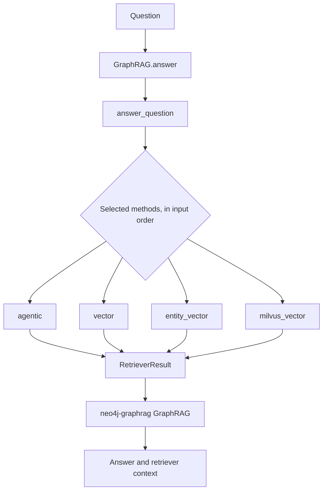
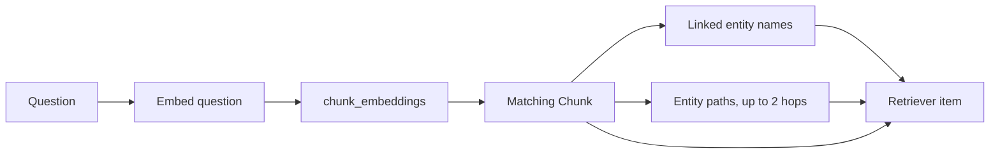

# Graph retrieval

Retrieval selects evidence for one question from Neo4j, or searches Milvus and
resolves its chunk IDs back to Neo4j, then passes that evidence to the answer
model. The public entry point is `GraphRAG.answer()` in
[`graphrag/graph_rag.py`](../../graphrag/graph_rag.py#L243-L258). It delegates to
`answer_question()` in
[`graphrag/retrieval/answering.py`](../../graphrag/retrieval/answering.py#L26-L65).

The four methods use different search logic or vector stores, then return
evidence to the same answer flow:

| Method | Search behavior | Vector store / index | Returned graph context |
| --- | --- | --- | --- |
| `agentic` | An LLM chooses vector search, Cypher search, or both. | Neo4j `chunk_embeddings` and Neo4j graph/schema. | Results from the tool calls, capped at five items. |
| `vector` | Embed the question and find similar chunks. | Neo4j `chunk_embeddings` index. | Chunk text, linked entities, and nearby graph paths. |
| `entity_vector` | Search chunk vectors copied onto entity-linked records. | Neo4j `entity_embeddings` index. | Chunk text and its linked entity; no graph paths. |
| `milvus_vector` | Embed the question and find similar chunks. | Milvus copy of chunk vectors, `FLAT` index with cosine similarity. | The same chunk and graph-context query as `vector`, fetched from Neo4j by chunk ID. |

All methods use the same final-answer flow. `milvus_vector` changes the vector
search index, not the graph store or graph-context query. `entity_vector` does
not embed entity names or descriptions: construction copies each associated
chunk vector to an entity-linked record.



## Inputs and outputs

`GraphRAG.answer()` receives the question and these keyword arguments:

| Input | Source | Use |
| --- | --- | --- |
| `question` | The dataset record | The vector query, Cypher prompt, and answer prompt. |
| `database` | `ConstructionMethod.database_name(record.id, run_id)` | The run-specific Neo4j database read by every retriever in this call. |
| `retrieval_methods` | The Streamlit method selection | The methods to build and run, in the given order. |
The `GraphRAG` instance keeps the configured models and passes them to the
retrievers. `GraphRAG.from_config()` creates these model objects:

| Object | Used by |
| --- | --- |
| `GraphRAGChatLLM` around the configured `ChatOpenAI` | The Neo4j GraphRAG answer call and `Text2CypherRetriever`. |
| The configured `ChatOpenAI` instance | The LangChain agent in `agentic`. |
| `OpenAIEmbeddings` | The `vector`, `entity_vector`, and `milvus_vector` searches. |
| `MilvusStore` | The Milvus chunk collection used by construction and `milvus_vector`. |

`answer_question()` returns one `RagResultModel` for each selected method. The
list order matches `retrieval_methods`. Each result has:

| Field | Meaning |
| --- | --- |
| `answer` | The answer model's text, or the no-context fallback. |
| `retriever_result.items` | The evidence items used to build the answer prompt. Each item has `content` and optional `metadata`. |
| `retriever_result.metadata` | Retriever-specific metadata when the retriever supplies it. |

Neo4j records become JSON before they enter `retriever_result.items`. This
keeps text, entities, graph facts, scores, and arbitrary Cypher columns in one
stable format for answering and evaluation.

The call sets `return_context=True` and `top_k=5`. The answer model receives at
most five items, and retrieval evaluation scores those same items.

## The shared answer flow

`answer_question()` follows the selected method list rather than a fixed method
order:

1. If `agentic` is selected, call `get_schema()` once for the target database.
2. Build the retriever for the current method.
3. Call `neo4j_graphrag.generation.GraphRAG.search()` with the question.
4. Return the answer and retriever context before building the next result.

The call uses this code:

```python
Neo4jGraphRAG(retriever, llm).search(
    question,
    retriever_config={"top_k": 5},
    return_context=True,
    response_fallback=NO_CONTEXT,
)
```

`llm` is the `GraphRAGChatLLM` adapter. It turns the LangChain
`ChatOpenAI` instance into the `neo4j-graphrag` interface and generates the
final answer. The answer prompt joins each retrieved item's `content` with a
newline. If the retriever returns no items, Neo4j GraphRAG skips the answer
model and returns this text:

```text
I could not find supporting context for this question.
```

## What each retriever reads

Construction creates two vector indexes in the target database:

| Index | Label | Property | Used by |
| --- | --- | --- | --- |
| `chunk_embeddings` | `Chunk` | `embedding` | `vector` and the vector tool in `agentic` |
| `entity_embeddings` | `EntityEmbedding` | `embedding` | `entity_vector` |

The embedding model turns the question into a vector before a vector search.
Both Neo4j indexes use cosine similarity and are managed inside their target
Neo4j database through native vector indexes.
For `entity_vector`, construction copies a chunk embedding and its text onto a
new `EntityEmbedding` node linked from one entity. This is a chunk vector
associated with an entity, not an embedding of the entity name or description.
See [Graph construction](construction.md#dual-write-storage) for the storage
write path.

`vector` and `entity_vector` use Neo4j vector indexes through
`VectorCypherRetriever`. `milvus_vector` searches Milvus and uses returned Neo4j
element IDs to fetch chunks and graph context.
The agentic Cypher tool uses `Text2CypherRetriever`; it runs `EXPLAIN` first and
rejects a generated query unless Neo4j reports it as read-only.

## Vector retrieval

`build_vector_retriever()` creates a `VectorCypherRetriever` with the
`chunk_embeddings` index and `VECTOR_RETRIEVAL_QUERY` from
[`graphrag/retrieval/retrievers.py`](../../graphrag/retrieval/retrievers.py#L11-L64).
The retriever embeds the question, finds similar `Chunk` nodes, and runs the
retrieval query for each match.

The query returns four values:

| Value | Query expression | Meaning |
| --- | --- | --- |
| `text` | `node.text` | The matched chunk text. |
| `entities` | `collect(DISTINCT entity.name)` | Entity names connected to the chunk through `FROM_CHUNK`. |
| `graph_facts` | A collection of path maps | Entity paths near the chunk, with node names and relationship direction. |
| `score` | The vector index score | The similarity score from Neo4j. |

The query builds `graph_facts` in two subqueries:

1. Match every `__Entity__` connected to the chunk through `FROM_CHUNK`.
2. Start from those entities and follow an undirected path of one or two relationships.
3. Drop paths that contain `FROM_CHUNK`, `NEXT_CHUNK`, or `FROM_DOCUMENT`.
4. Keep at most 25 paths for the chunk.
5. Convert each path to `{nodes, relationships}`. A relationship stores its source name, type, and target name.

The query does not ask Neo4j to order the graph paths. The vector score orders
the matched chunks, while the graph paths inside one chunk are the collected
context returned by the query.



## Entity-vector retrieval

`build_entity_vector_retriever()` uses the `entity_embeddings` index and
`ENTITY_VECTOR_RETRIEVAL_QUERY` from
[`graphrag/retrieval/retrievers.py`](../../graphrag/retrieval/retrievers.py#L42-L77).
The query is deliberately smaller than the chunk-vector query:

```cypher
MATCH (entity:__Entity__)-[:HAS_EMBEDDING]->(node)
RETURN node.text AS text, [entity.name] AS entities, [] AS graph_facts, score
```

Each `EntityEmbedding` node contains a copy of a chunk's vector and text, linked
to one entity. Search returns the chunk text and linked entity name. It does not
traverse the graph. Its `graph_facts` value is always an empty list.

That difference matters when comparing methods. `entity_vector` can find an
entity-associated chunk, but it does not add the two-hop graph context that
the `vector` method adds.

## Milvus vector retrieval

Construction writes every chunk vector to both its Neo4j `Chunk` and a
run-specific Milvus collection. Milvus stores the vector plus the Neo4j
`elementId` as the primary key; its configured index is `FLAT` with cosine
similarity. `FLAT` compares the query against the stored vectors directly.
Neo4j's native index is managed inside its graph database; this code does not
select its internal index algorithm. Milvus does not store graph nodes,
relationships, or chunk text. It is a separate collection and index, not a
Neo4j index.

At query time, `milvus_vector` embeds the question, searches that Milvus index,
then looks up the matching chunks in Neo4j and runs the same graph-context query
as `vector`. So the comparison is Neo4j's native vector index versus Milvus's
`FLAT` vector index for chunk search; the graph and returned context are still
from Neo4j. `entity_vector` remains Neo4j-only. This design difference does not
show which index is faster; retrieval latency has not been measured.

## Agentic retrieval

`build_agentic_retriever()` builds two tools:

| Tool | Retriever | Input and read path |
| --- | --- | --- |
| `vector_search` | `VectorCypherRetriever` | Embeds the tool query and searches `chunk_embeddings` with the same graph-context query as `vector`. |
| `cypher_search` | `Text2CypherRetriever` | Sends the tool query and the current Neo4j schema to `gpt-6-luna`, then checks and runs the generated read-only Cypher. |

The agent uses the configured answer `ChatOpenAI` model. Its system instruction
sets this sequence:

```text
Before any evidence has been returned, call exactly one retrieval tool.
After reviewing evidence, either call the next best tool with a refined query
or make no tool call if the evidence is sufficient.
Do not repeat a search that returned no new evidence.
```

`ModelCallLimitMiddleware` sets a limit of five model calls for one agent run.
The agent can call the second tool after it sees the first tool's result.

The wrapper in
[`graphrag/retrieval/agentic.py`](../../graphrag/retrieval/agentic.py#L27-L74)
converts each tool result into a `neo4j.Record` with these fields:

| Field | Meaning |
| --- | --- |
| `content` | The underlying retriever item's content. |
| `tool_name` | The tool that returned the item. |
| `metadata` | The underlying metadata plus the tool name. |

`AgenticToolsRetriever` collects the artifacts from every `ToolMessage`, then keeps
at most five items. The answer model and retrieval evaluator use that same list.
It does not return the agent's final prose as an evidence item.

## Failure and boundary cases

- If a selected method is not one of `agentic`, `vector`, `entity_vector`, or `milvus_vector`, `answer_question()` raises `ValueError`.
- If `agentic` is selected and schema loading fails, no agentic retriever is built.
- If a vector index is missing, `VectorCypherRetriever` fails while it is built. Construction must create and await the indexes first.
- If a retriever returns no items, the answer is the fallback text and `retriever_result.items` is empty.
- If the agent makes no tool call or a tool returns no records, the agentic result has no evidence items.
- Retrieval reads the database. It does not create nodes, relationships, embeddings, or indexes.

The [evaluation reference](evaluation.md) explains how the returned context and
answer are scored. The [construction reference](construction.md) explains how
the database and indexes are built.
