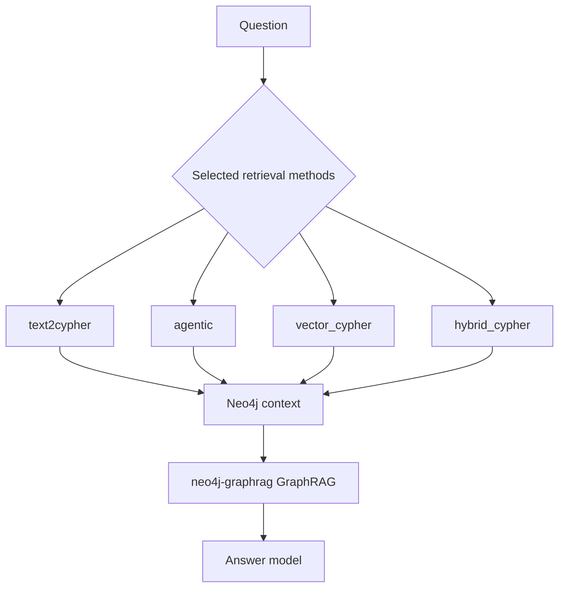

# Graph retrieval

Retrieval selects context from the Neo4j graph for one question. The public
`GraphRAG.answer()` method calls `answer_question()` in
[`graphrag/retrieval/answering.py`](../../graphrag/retrieval/answering.py).
This page calls the two graph-aware methods `vector_cypher` and
`hybrid_cypher`, following Neo4j's [`VectorCypherRetriever`](https://neo4j.com/docs/neo4j-graphrag-python/current/user_guide_rag.html#vector-cypher-retriever)
and [`HybridCypherRetriever`](https://neo4j.com/docs/neo4j-graphrag-python/current/user_guide_rag.html#hybrid-cypher-retrievers) names.



## Answer flow

`answer_question()` keeps the requested method order. If the request includes
`text2cypher` or `agentic`, it reads the current Neo4j schema first. It then
builds one retriever for each selected method and runs:

```python
Neo4jGraphRAG(retriever, llm).search(
    question,
    return_context=True,
    response_fallback=NO_CONTEXT,
)
```

The fallback text is:

```text
I could not find supporting context for this question.
```

The answer model receives the context returned by the retriever. The same
configured `gpt-5.6-luna` model handles answer generation, and the OpenAI
Responses API is enabled in `GraphRAG.from_config()`.

## Retrieval methods

| Method | Implementation | Search behavior |
| --- | --- | --- |
| `text2cypher` | `Text2CypherRetriever` | Gives the schema to an LLM, which writes and runs a read-only Cypher query. |
| `agentic` | `ToolsRetriever` with a LangChain agent | Lets an agent choose vector search or Text2Cypher search and refine the question after reading results. |
| `vector_cypher` | [`VectorCypherRetriever`](../../graphrag/retrieval/retrievers.py#L74-L82) | Searches the `chunk_embeddings` index by embedding similarity and adds graph context. See the [Neo4j Vector Cypher Retriever guide](https://neo4j.com/docs/neo4j-graphrag-python/current/user_guide_rag.html#vector-cypher-retriever). |
| `hybrid_cypher` | [`HybridCypherRetriever`](../../graphrag/retrieval/retrievers.py#L86-L95) | Searches both `chunk_embeddings` and `chunk_fulltext`, then adds graph context. See the [Neo4j Hybrid Cypher Retrievers guide](https://neo4j.com/docs/neo4j-graphrag-python/current/user_guide_rag.html#hybrid-cypher-retrievers). |

## Text2Cypher retrieval

`build_text2cypher_retriever()` creates a `Text2CypherRetriever` with the
current Neo4j schema when one is available. The retriever turns the question
into a Cypher query and runs it against the selected database. This method
depends on the generated query matching the graph's entity and relationship
names.

## Agentic retrieval

`build_agentic_retriever()` gives the agent two tools:

- `vector_search`, backed by `VectorCypherRetriever`;
- `cypher_search`, backed by `Text2CypherRetriever`.

The agent must call exactly one tool before it has evidence. After it reads the
result, it can call the other tool with a refined question or stop. The
`ModelCallLimitMiddleware` allows up to five model calls for one retrieval.
The retriever returns the artifacts from tool messages as Neo4j records.

## Vector Cypher and hybrid Cypher retrieval

Both methods use a Cypher retrieval query that returns four values for each
matching chunk:

| Value | Meaning |
| --- | --- |
| `text` | The chunk text. |
| `entities` | Entity names linked to the chunk. |
| `graph_facts` | Nearby graph paths and their relationship details. |
| `score` | The search score returned by the retriever. |

The graph query follows entity paths up to two relationships. It excludes the
internal `FROM_CHUNK`, `NEXT_CHUNK`, and `FROM_DOCUMENT` relationships. It
limits the graph context to 25 paths for each chunk.

The `vector_cypher` method uses `chunk_embeddings`. The `hybrid_cypher` method
combines that index with `chunk_fulltext`. Both methods use the configured
embedder for vector search.

## Storage and boundaries

Neo4j stores the chunks, embeddings, entities, relationships, vector index,
and full-text index. Each record and construction method has its own database,
so retrieval methods compare against the same graph without sharing data with
another construction method.

The [construction reference](construction.md) describes how those databases
are built. The [evaluation reference](evals.md) describes how returned context
and answers are scored.
