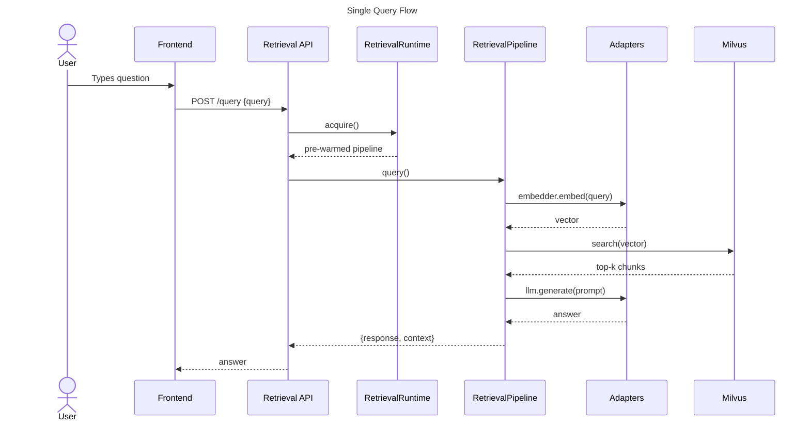
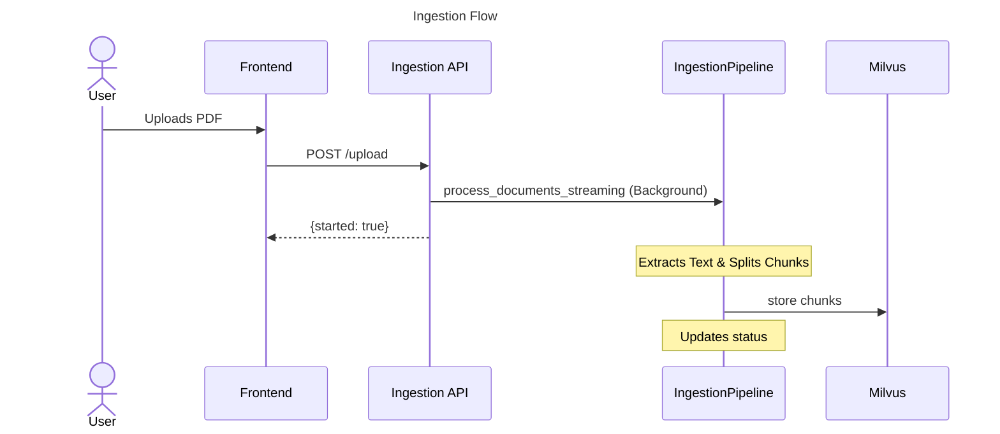

# Module 5: Tracing Flows

Let's trace the full journey of a user action.

## Tracing a Query

When the frontend calls `POST /query`:

```mermaid
---
title: Single Query Flow
---
sequenceDiagram
    actor User
    participant Frontend as Frontend
    participant API as Retrieval API
    participant Runtime as RetrievalRuntime
    participant Pipeline as RetrievalPipeline
    participant Adapters as Adapters
    participant Milvus as Milvus
    
    User->>Frontend: Types question
    Frontend->>API: POST /query {query}
    API->>Runtime: acquire()
    Runtime-->>API: pre-warmed pipeline
    API->>Pipeline: query()
    Pipeline->>Adapters: embedder.embed(query)
    Adapters-->>Pipeline: vector
    Pipeline->>Milvus: search(vector)
    Milvus-->>Pipeline: top-k chunks
    Pipeline->>Adapters: llm.generate(prompt)
    Adapters-->>Pipeline: answer
    Pipeline-->>API: {response, context}
    API-->>Frontend: answer
```

## Tracing an Ingestion

When the user uploads a document:

```mermaid
---
title: Ingestion Flow
---
sequenceDiagram
    actor User
    participant Frontend
    participant API as Ingestion API
    participant Pipeline as IngestionPipeline
    participant Milvus
    
    User->>Frontend: Uploads PDF
    Frontend->>API: POST /upload
    API->>Pipeline: process_documents_streaming (Background)
    API-->>Frontend: {started: true}
    
    Note over Pipeline: Extracts Text & Splits Chunks
    Pipeline->>Milvus: store chunks
    Note over Pipeline: Updates status
```

