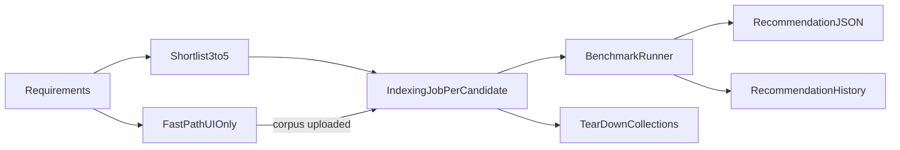

# Recommendation System — Design Decisions

Record of architecture and product decisions from the recommendation system design
session. Each entry follows: **problem → options → decision → reasoning**.

Use this document when implementing `src/orchestration/`, `app/orchestrator/`,
benchmark flow, and intake UI. Research-only behaviors are marked; archive or remove
before production.

**Unresolved items:** [OPEN_QUESTIONS.md](./OPEN_QUESTIONS.md)

**Operating guide:** [AGENTS.md](../../AGENTS.md) — requires documenting *why* on every
meaningful code change; close TBDs here when decided.

---

## Naming conventions

**Problem:** Plan terminology (`UseCaseProfile`, `RulesPlusOrchestrator`, etc.)
was inconsistent and not developer-friendly.

**Decision:** Use the glossary below in code and APIs.

| Term | Meaning |
|------|---------|
| `Requirements` | Structured intake (use case, audience, document modality, budget, constraints) |
| `PipelineSpec` | One runnable pipeline: `RagArchitecture` + ingestion + retrieval slots |
| `RagArchitecture` | `naive`, `citation`, `multimodal` (active); `graph`, `agentic` (commented) |
| `PipelineCandidate` | A `PipelineSpec` before indexing/benchmark |
| `ScoredCandidate` | A `PipelineCandidate` after benchmark with scores and rank |
| `OrchestrationEngine` | Module: `constraints.py` + `resolver.py` + `customizer.py` |
| `Orchestrator API` | FastAPI service (`:8002`) coordinating intake, benchmark, export |
| `BenchmarkSuite` | Standard + domain + user queries (+ architecture probes) |
| `BenchmarkRunner` | Executes suite against each collection |
| `FeasibilityScore` | Pre-benchmark estimate; not the same as benchmark scores |
| `run_id` | Session ID tying intake → candidates → benchmark → export |

**Reasoning:** Names follow `{Noun}Request` / plain domain nouns / verb-noun modules.
A new developer can trace `Requirements` → `RecommendationEngine` → `BenchmarkRunner`
without reading the whole plan.

---

## D1 — Ingestion is not globally fixed

**Problem:** Plan said “ingestion is mostly fixed; optimize retrieval,” which implied
one ingest path for all use cases.

**Options:**
- A) One canonical index per document set, built only after user picks a winner
- B) Pre-build separate indexes per recommended option for immediate compare
- C) One rich shared index; graph/agentic layers on top

**Decision:** **Benchmark requires indexing every shortlisted candidate** (see D2).
Ingestion choices are use-case-relative: text-heavy + citations (e.g. law firm) has
few ingest options, so retrieval is where budget is optimized. Image-heavy or
graph-oriented cases have more ingest variance.

**Reasoning:** User clarified “fixed” applies per use case, not as a global rule.
Fair comparison requires separate indexes when ingest config differs (embedding,
extraction mode, chunk policy).

---

## D2 — Why narrow to 3–5 candidates

**Problem:** What does “2–4 recommendations” mean, and why not run every permutation?

**Options:**
- Exhaustive permutation search
- Narrow to a small shortlist, then measure

**Decision:** Collapse thousands of permutations to **3–5 `PipelineCandidate`s**,
index each, run the same `BenchmarkSuite`, rank by evidence. Narrowing limits eval
cost and runtime, not user choice (user does not pick among options).

**Reasoning:** The product delivers one recommendation. Internal benchmark is how
we justify it. Full permutation search is infeasible; pure guessing without
benchmark is unacceptable for export (see D12).

---

## D3 — Candidate count and trust in narrowing

**Problem:** How many candidates, and how much to trust pre-benchmark filtering?

**Options:**
- A) Always 4, force architecture diversity
- B) Dynamic 2–4 from constraints
- C) Always 3
- D) User slider

**Decision:** **Minimum 3, maximum 5** during research/development. Do not
over-trust early `FeasibilityScore` to cut the field to 2.

**Reasoning:** System is in ideation; assuming the first two survivors are best is
unhealthy. Breadth supports research; prod behavior will be informed later and
research tooling archived (see D8).

---

## D4 — Backfill when hard constraints leave fewer than 3

**Problem:** If only 1–2 architectures pass hard filters, how do we reach minimum 3?

**Options:**
- A) Relax soft constraints only
- B) Retrieval variants (same architecture, different LLM/top_k/reranker)
- C) Include “stretch” architectures with warnings
- D) A then B then C as last resort

**Decision:** **D** — *(development / research handling only)*

1. Relax soft constraints (budget, complexity deprioritization)
2. Add retrieval-config variants of the same `RagArchitecture`
3. Stretch architectures last, with explicit warnings

**Reasoning:** Avoid padding for padding’s sake (confuses users). Systematic
exploration during dev prevents prod surprises. Document findings in experiment
logs (D7). Not the default prod UX.

---

## D5 — Document modality (intake field #3)

**Problem:** “Modality” was ambiguous (user interaction vs document type).

**Decision:** **Document modality** — what users query: `text_heavy`, `scanned`,
`image_heavy`, `video`, `mixed`.

**Reasoning:** Drives extraction mode (text vs vision-assisted) and architecture
eligibility (`multimodal`).

---

## D6 — Corpus timing in the flow

**Problem:** When must documents exist relative to recommend vs benchmark?

**Options:**
- A) Documents required before any recommendation
- B) Intake-only recommend; upload only before indexing
- C) Flexible: recommend on intake; refine from corpus analysis if present;
  benchmark gated on corpus

**Decision:** **C**

**Reasoning:** Dual intake stays fast. Corpus usually present (see D11) but not
always. Cost estimates labeled by confidence (`no_corpus` vs `corpus_based`).

---

## D7 — Benchmark query suite composition

**Problem:** Where do eval queries come from for fair, personalized comparison?

**Options:**
- A) User-provided only
- B) LLM-generated only
- C) Hybrid: generate + user review
- D) Industry templates only

**Decision:** **C + templates (long-term)** — three layers when templates exist:
- **Standard:** industry template baseline (bias control, internal standard set)
- **Domain:** generated from `Requirements`, user reviews
- **User:** optional questions from wizard/chat

Default mix when templates exist (tunable): ~40% standard, ~40% domain, ~20% user.

**v1 / ideation:** **No industry templates yet** (see D24). Suite = domain-generated
+ user queries + architecture probes only. Templates added once research picks a
starting vertical.

---

## D8 — Standard template scope (two-dimensional)

**Problem:** How are industry templates and architecture types combined?

**Options:**
- A) Per `RagArchitecture` only
- B) Per industry only
- C) Industry standard set + architecture-specific probes
- D) One universal standard set

**Decision:** **C**

**Reasoning:** Industry pack ensures fair cross-architecture comparison for the
same use case. Architecture probes test what each pattern is for (e.g. graph
multi-hop) without ranking graph RAG only on naive-RAG questions.

---

## D9 — Research artifacts vs production

**Problem:** How does dev/research behavior differ from prod long-term?

**Decision:** Build full research flow now (experiment JSON, markdown findings,
stretch backfill, 3–5 candidates). **Archive or remove research scaffolding before
prod** — no permanent `RESEARCH_MODE` split to maintain.

**Reasoning:** User intent: explore during development, document learnings, ship a
cleaner prod surface informed by research.

**Research logging (dev):** `state/experiments/{run_id}.json` + auto markdown in
`docs/research/findings/` (option B from session).

---

## D10 — User outcome after benchmark

**Problem:** Does the user select a pipeline from ranked results?

**Options:**
- A) Explicit selection required
- B) Pre-selected winner + confirm
- C) Select any or reject all
- D) Auto-apply winner

**Decision:** **None of the above** — user does nothing. **The recommendation is the
product.** Benchmark ranking is internal; user receives one answer.

**Reasoning:** Users came for a recommendation, not a pipeline management UI.

---

## D11 — Product deliverable (out of scope: deploy pipeline)

**Problem:** What does the user receive?

**Options:**
- A) Report only
- B) Report + auto-applied RecRAG workspace
- C) Report + exportable blueprint (JSON/config + setup instructions)
- D) B + C

**Decision:** **C**. **B is out of scope** — building/deploying the pipeline inside
RecRAG is not part of the recommendation system.

**Reasoning:** Aligns with original vision: recommend, don’t build. User deploys
elsewhere using the blueprint.

---

## D12 — Fast path vs deep path

**Problem:** Corpus often missing initially; how do fast and benchmarked paths differ?

**Options:**
- A) Same schema, `confidence` field
- B) Two deliverable types
- C) Fast path non-exportable; export only after benchmark
- D) Same export with `unbenchmarked` flag

**Decision:** **C**

- **Fast (no corpus):** preliminary recommendation in UI only — architecture, tiers,
  rationale, estimated cost. **Not downloadable.**
- **Deep (corpus):** index 3–5 candidates, benchmark, final recommendation.
  **Export unlocked.**

**Reasoning:** Without benchmark, recommendation is an informed guess. Export
implies evidence.

---

## D13 — Exported blueprint format

**Problem:** What format for the deployable artifact?

**Options:**
- A) RecRAG TOML only
- B) Provider-agnostic JSON
- C) JSON canonical + TOML generated
- D) Industry standard (OpenRAG, etc.)

**Decision:** **Plain JSON** — architecture, resolved model params, ingestion/
retrieval config, cost, rationale. No dual formats or heavy schema ceremony.

**Reasoning:** Goal is to communicate the recommended pipeline clearly, not build a
portability framework yet.

---

## D14 — Export JSON contents

**Problem:** Include runner-up detail or winner only?

**Options:**
- A) Winner only
- B) Winner + compact `benchmark_summary`
- C) Winner + full `alternatives[]`
- D) Winner in JSON; comparison in separate report

**Decision:** **B** — full winner spec plus compact `benchmark_summary`
(`confidence: measured`, scores, `candidates_evaluated`, `margin_over_runner_up`).

**Reasoning:** JSON stays deploy-focused; summary proves measurement without four
full runner-up configs. Full comparison lives in research logs during dev.

---

## D15 — Active `RagArchitecture` set

**Problem:** `graph` and `agentic` are not implemented; how to handle in shortlist?

**Options:**
- A) Implement all five before any benchmark
- B) Shortlist only runnable architectures
- C) Proxy benchmark via similar architecture
- D) Phased: naive, citation, multimodal first

**Decision:** **`naive`, `citation`, `multimodal` active.** `graph`, `agentic`
**commented out** in catalog/enum until implemented or removed entirely.

**Reasoning:** Eventually implement or remove for consistency. No proxy scoring.
Commented = not offered, not benchmarked.

---

## D16 — Where recommendation rules live

**Problem:** How do developers tune constraints during research?

**Options:**
- A) Python only
- B) Config only
- C) Hybrid
- D) LLM-only

**Decision:** **C** — hard constraints in Python (`constraints.py`); soft weights
and industry→template mappings in TOML (`data/recommendation_rules.toml`).

**Reasoning:** Invariants are tested in code; research tuning edits config without
deploy. LLM-only is not reproducible enough.

---

## D17 — Recommendation LLM (customizer)

**Problem:** Which model adjusts `PipelineSpec` and writes rationale?

**Decision:** **Separate provider/model from the recommended pipeline LLM.** User
can choose; sensible default in config (`[recommendation]` section).

**Reasoning:** “Model that recommends” ≠ “model in the blueprint.” Decouples roles.

---

## D18 — Recommendation history and index lifecycle

**Problem:** After benchmark, what persists?

**Options:**
- A) Delete all indexes immediately
- B) TTL cleanup
- C) Session-scoped until new run
- D) Keep indefinitely

**Decision:** **Preserve recommendation workflows and configs; tear down runtime
pipelines (Milvus collections).**

- Store per `run_id`: `Requirements`, all `PipelineCandidate` specs, `BenchmarkSuite`,
  scores, final JSON blueprint, timestamps.
- User can **look up past recommendation workflows**.
- Pipelines are config-only to recreate; storing configs is cheap.

**Reasoning:** Product value includes history. Vector indexes are ephemeral
infrastructure; configs are the source of truth.

---

## D19 — Two ranking stages (clarification)

**Problem:** Is the user-facing list final before or after benchmark?

**Decision:** Two stages:
1. **Preliminary shortlist** — before indexing (`FeasibilityScore`, estimates).
2. **Final ranking** — after indexing + `BenchmarkRunner` (drives export).

Order can change after benchmark.

---

## D20 — Index / collection identity

**Problem:** Today collection names only encode embedding + vision model; chunk policy
and architecture can collide.

**Decision:** Extend collection naming to include **ingest policy identity**
(architecture, chunk policy, extraction mode) — e.g. hash or structured suffix.
*(Implementation detail; required for parallel candidate indexes.)*

**Reasoning:** 3–5 parallel benchmarks on the same corpus must not overwrite each
other.

---

## End-to-end flow (agreed)

---

## D21 — Recommendation history storage

**Problem:** Where to persist past recommendation workflows for user lookup without
impacting the main RAG ingestion/retrieval path?

**Options:**
- A) Filesystem JSON under `state/recommendations/{run_id}/`
- B) SQLite in `state/`
- C) Postgres / external managed database
- D) Browser `localStorage` only

**Decision:** **C — Postgres (external managed DB)**

**Reasoning:** Filesystem and in-memory stores risk slowing the main system when
history lookups occur (even if infrequent). A managed DB isolates recommendation
metadata I/O from pipeline hot paths. Supports multi-user access and query/filter
for a history UI without loading JSON trees from disk on the API process.

**Stored per run (minimum):** `run_id`, `Requirements`, candidate `PipelineSpec`s,
`BenchmarkSuite` reference, scores, final blueprint JSON, `benchmark_summary`,
timestamps, user/session identifier (when auth exists).

---

## D23 — Chat intake session storage

**Problem:** Chat-based intake spans multiple messages. Where is partial `Requirements`
stored between turns?

**Options:**
- A) Postgres `intake_sessions` table (keyed by `session_id`)
- B) Client sends full chat history each turn; server stateless until submit
- C) Signed token on client carries partial state

**Decision:** **A — Postgres**

**Reasoning:** Same persistence layer as recommendation history (`D21`). Survives page
refresh, auditable during research, links cleanly: `intake_session` → `run_id` when
benchmark starts.

---

## D24 — Industry benchmark templates (v1)

**Problem:** Which industry standard query packs ship in the first build?

**Options:**
- A) Legal + general fallback
- B) General only
- C) Legal + medical + support
- D) None until research picks a starting experiment vertical

**Decision:** **D — no industry templates for now**

**Reasoning:** Product is still in ideation. Templates are created along the way once
the team decides where to start experiments. `BenchmarkSuite` v1 uses domain-generated
queries, optional user queries, and architecture probes (D8). Industry standard layer
plugs in later without changing suite structure.

---

## D25 — Model tier resolution (price-based)

**Problem:** How to map `embedding_tier` / `llm_tier` (`flagship`, `mid`, `economy`) to
concrete models when provider catalogs change frequently?

**Options considered:**
- Manual pattern file only (`text-embedding-3-*` → flagship)
- LLM picks models with no tier abstraction
- Price-based ranking from provider

**Decision:** **Price-based tiers per provider and model category (embedding vs LLM):**

| Tier | Rule |
|------|------|
| `flagship` | Most expensive model in category from that provider |
| `mid` | Middle of price distribution (or one step below flagship) |
| `economy` | Cheapest model that still meets minimum capability gates |

Resolver:
1. Fetch live model list from `/providers`
2. Filter by category (embedding / LLM / vision)
3. Apply hard capability gates in Python (e.g. embedding-only for embed slot)
4. Rank by price within provider → assign tier

Customizer may override with justification logged to Postgres.

**Reasoning:** Flagship models have a clear signal — they are the most expensive
offering from a provider. Avoids maintaining stale “flagship model name” lists.
Pricing data from `data/model_pricing.toml` (see D26).

---

## D26 — Model pricing data source

**Problem:** `/providers` lists model IDs but not prices. Tier ranking requires cost
per model.

**Options:**
- A) `data/model_pricing.toml` — manually maintained, joined with live `/providers`
- B) Provider billing APIs
- C) LLM-estimated prices
- D) TOML + automated refresh from provider docs

**Decision:** **A — `data/model_pricing.toml` for v1**

**Reasoning:** Explicit, auditable, sufficient for research. New models from
`/providers` without a price entry surface as “price unknown” until added. Automated
refresh (D) can follow later.

---

## D27 — Postgres deployment

**Problem:** How should Postgres for recommendation data relate to the rest of RecRAG?

**Options:**
- A) Dedicated managed Postgres + Alembic migrations in-repo
- B) Dedicated Postgres + ad-hoc SQL until schema stabilizes
- C) Shared Postgres with other app data

**Decision:** **A — dedicated managed Postgres + Alembic**

**Reasoning:** Isolates recommendation/history I/O from ingestion/retrieval hot paths (D21).
Alembic versions schema changes (`intake_sessions`, `recommendation_runs`, etc.) from
day one so research-phase churn stays reproducible across environments.

**Connection:** `DATABASE_URL` env var (not in `config.toml`); secrets in `.env`.

---

## D33 — PipelineBlueprint JSON schema (TC-1)

**Decision:** Implemented in `orchestration.models.PipelineBlueprint`:
`run_id`, `workspace_id`, `architecture`, `ingestion`, `retrieval`, `rationale`,
`pros`, `cons`, `estimated_monthly_usd`, `benchmark_summary`, `generated_at`.

---

## D34 — Orchestrator API routes (TC-7)

| Method | Path | Purpose |
|--------|------|---------|
| GET | `/health` | Liveness |
| POST | `/intake/extract` | Free text → partial Requirements |
| POST | `/intake/chat` | Conversational intake session |
| POST | `/runs` | Start recommendation workflow |
| GET | `/runs` | List workspace runs |
| GET | `/runs/{id}` | Run status + preliminary/blueprint |
| GET | `/runs/{id}/export` | Download blueprint JSON (deep path only) |
| POST | `/runs/{id}/retention` | yes / no / later collection retention |

---

## D35 — Benchmark indexing policy (BM-5, BM-6)

- **BM-5:** Sequential indexing (ingestion single-job lock); parallel benchmark queries.
- **BM-6:** Skip failed candidate index/benchmark; fail run only if zero successes.

---

## D36 — Corpus handoff (TC-8)

Orchestrator calls ingestion `GET /files` on shared corpus; targeted ingest uses
`POST /ingest/target` with per-candidate `collection_name` and chunk params.

---

## D28 — Orchestrator service (separate from retrieval)

**Problem:** Where do orchestration routes live? Retrieval API was considered but
couples scaling and makes ingestion-only testing depend on retrieval.

**Options:**
- A) Routes on retrieval API (`:8000`)
- B) New Orchestrator API (`:8002`) — calls ingestion/retrieval as clients
- C) Standalone service duplicating provider logic

**Decision:** **B — dedicated Orchestrator API**

**Reasoning:**
- **Independent scaling** — retrieval can scale for query load without orchestration/
  benchmark traffic.
- **Isolated testing** — ingestion and retrieval remain testable on their own;
  orchestrator integration-tested via HTTP clients.
- Orchestrator owns: intake sessions, Postgres, shortlist/benchmark workflow, export,
  collection retention prompts. Ingestion/retrieval stay single-purpose.

**Naming:**
| Layer | Name |
|-------|------|
| Service / process | **Orchestrator API** (`app/orchestrator/`, port `:8002`) |
| User-facing product | **Recommendation** (what the user receives) |
| HTTP resources | `POST /runs`, `GET /runs/{run_id}`, `POST /intake/sessions/...` — not `/recommend` |
| Internal Python package | `src/orchestration/` (engine, constraints, resolver, customizer, cost) |
| LLM step that tweaks `PipelineSpec` | **Customizer** (not “the orchestrator” alone — avoids name collision) |

**Reasoning on “orchestrator” vs “recommend”:** “Recommend” describes the outcome;
“orchestrator” describes the coordinating service that drives ingestion jobs,
benchmark runs, Postgres, and export. Users still “get a recommendation”; the
service that produces it is the Orchestrator API.

---

## D29 — Re-benchmark “later” retention window

**Problem:** When user chooses “re-benchmark later” (D22), how long are candidate
collections kept before auto-teardown?

**Options:**
- A) Fixed 1h
- B) Fixed 24h
- C) Fixed 7d
- D) User picks duration (with a default)

**Decision:** **D — user selects duration when choosing “later”**

Preset options: **1h / 24h / 7d**. Default if unspecified: **24h**.

**Reasoning:** Balances convenience (“come back tomorrow”) vs infra cost. Teardown
still async after window expires. “No” choice tears down immediately (async). “Yes”
keeps collections until user completes re-benchmark or explicitly releases.

---

## D30 — Run ownership (workspace-scoped)

**Problem:** Who can see past recommendation runs in Postgres?

**Options:**
- A) No auth — all runs shared on instance
- B) Optional `user_id` when auth exists
- C) Auth required from day one
- D) `workspace_id` — runs belong to a workspace; members share history

**Decision:** **D — workspace-scoped from schema day one**

**Reasoning:** Research now but prod eventually; nullable-less design avoids a large
refactor later. `recommendation_runs.workspace_id` + `intake_sessions.workspace_id`
required on every row. User identity within workspace can layer on when auth ships.

---

## D31 — Auth and workspace identity (Clerk)

**Problem:** How is `workspace_id` created, and how do users authenticate?

**Decision:** **Clerk** for auth; **Clerk Organizations** map to `workspace_id`.

**Stack compatibility:**

| Layer | Clerk support |
|-------|----------------|
| **Next.js 16 App Router** | `@clerk/nextjs` — middleware, `auth()`, client hooks; fully supported |
| **Orchestrator API (FastAPI)** | Verify Clerk session JWT (`Authorization: Bearer`) via JWKS; extract `sub` (user), `org_id` (workspace) |
| **Ingestion / Retrieval APIs** | Keep existing optional `RecRAG-API-Key` for service/dev; user identity verified at Orchestrator only for v1 |
| **Postgres** | `workspaces.clerk_org_id`, `users.clerk_user_id`; sync on first request or Clerk webhook |

**Flow:**
1. User signs in via Clerk on frontend.
2. User selects or creates a **Clerk Organization** (= workspace).
3. Frontend calls Orchestrator with Clerk session token; `org_id` → `workspace_id`.
4. All `recommendation_runs` and `intake_sessions` scoped to that org.

**Coexistence:** `REC_RAG_API_KEY` on ingestion/retrieval remains for direct API access /
automation; Orchestrator uses Clerk for user-facing routes. Orchestrator calls
ingestion/retrieval with service API key internally during benchmark.

**Reasoning:** Building workspace-scoped schema (D30) now; Clerk Organizations avoid
custom workspace provisioning. Compatible with current stack; no conflict with existing
API-key auth on Python services.

**Packages (when implemented):** `@clerk/nextjs` (frontend); `PyJWT` + `cryptography`
or `clerk-backend-api` (orchestrator JWT verification).

---

## D32 — Clerk B2B: webhooks required?

**Problem:** Must we use Clerk webhooks to sync Organizations into Postgres?

**Decision:** **No — webhooks not required for v1.**

Clerk B2B (Organizations) puts `org_id` and `sub` in the session JWT on every
authenticated request. Orchestrator can:

1. Verify JWT (JWKS)
2. Read `org_id` → map to `workspace_id`
3. **Lazy upsert** `workspaces` row on first request if missing
4. Scope all queries by `workspace_id`

**When webhooks become worth adding (later, not ideation):**
- Org deleted in Clerk → cascade/delete or archive Postgres data (GDPR)
- Cache membership roster for admin UI without calling Clerk API
- React to billing/plan changes on the org

**Reasoning:** B2B auth identity and active org context already arrive with each
request. Webhooks add infra and failure modes without helping the core flow (start
run → benchmark → export → history lookup).

---

---

## D22 — Benchmark collection teardown (user-driven)

**Problem:** When to delete Milvus collections after benchmark completes and configs
are persisted to Postgres?

**Options considered:**
- Automatic async teardown immediately after benchmark
- User-driven retention with re-benchmark option

**Decision:** **Ask the user after benchmark completes:**

| User choice | Behavior |
|-------------|----------|
| **Yes** — re-benchmark soon | Keep all candidate collections so re-run is fast (no re-ingest) |
| **No** — done | Tear down candidate collections; configs remain in Postgres |
| **Later** — re-benchmark after some time | Keep collections for a configured window, then async teardown |

**Reasoning:** Re-benchmark is a real use case (tweaked suite, corpus update). User
controls infra cost vs convenience. Configs are always preserved in Postgres;
collections are only kept when the user may need them again. Teardown on "No" can
still be async so the UI is not blocked.

---

## Related files

- [AGENTS.md](../../AGENTS.md) — product vision (update document modality + archetypes)
- Plan: `.cursor/plans/rag_recommendation_system_3de486ca.plan.md` — initial plan;
  **this document supersedes** where they conflict.
