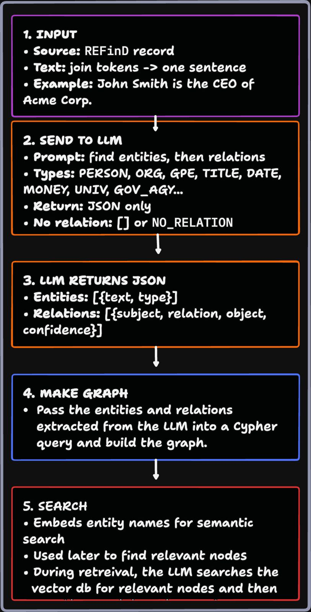
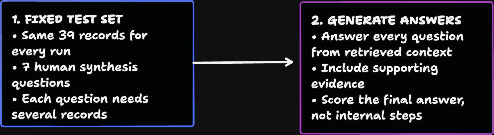
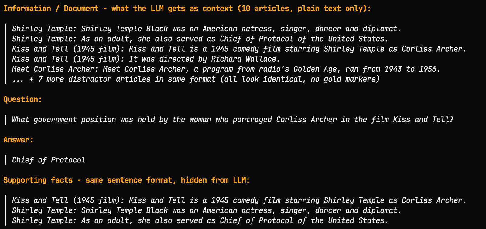

# REFinD experiment notes

This page is a preserved historical source note.

REFinD is a historical experiment. The current code has no REFinD loader or
REFinD run path. The notes below preserve what the supplied experiment material
said; they do not describe the current implementation.

## What the experiment tried

The experiment tested whether a record could become a searchable graph:

1. Join the tokens in a REFinD record into one sentence.
2. Ask an LLM to find entities and relationships.
3. Return the extracted facts as JSON.
4. Use the facts to build a graph with a Cypher query.
5. Embed entity names and use them to find relevant graph nodes later.

The recorded entity shape was `{"text": "...", "type": "..."}`. The recorded
relationship shape was `{"subject": "...", "relation": "...", "object": "...", "confidence": 0.0}`.

The extraction prompt listed types such as `PERSON`, `ORG`, `GPE`, `TITLE`,
`DATE`, `MONEY`, `UNIV`, and `GOV_AGY`. The type list was open-ended. The prompt
requested JSON only and used `[]` or `NO_RELATION` when it found no relationship.

## Why the experiment used a graph

A question can refer to an entity in one sentence and ask about a fact in
another sentence. The graph gives the system named entities and relationships
that it can search after extraction.

The supplied pipeline image cuts off the last retrieval step. This note does
not infer what happened after the system found graph nodes.

## Answer evaluation

The experiment used the same 39 records for every run. It used seven human-written
synthesis questions. Each question needed several records.

The LLM received ten plain-text articles. Each article used the same
`Title: sentence` format. The articles did not mark the supporting facts. The
experiment generated an answer from retrieved context and included supporting
evidence. It scored the final answer rather than internal retrieval steps.

## Example

The question asked what government position the woman who portrayed Corliss
Archer in *Kiss and Tell* held. The expected answer was `Chief of Protocol`.

The hidden supporting facts linked the film to Shirley Temple and stated that
Shirley Temple Black served as Chief of Protocol of the United States.

The source screenshot also shows the ten-article context and the hidden
supporting facts for this question.

Another example asked how Hannon Armstrong Sustainable Infrastructure Capital,
Inc. was organized after the 2013 IPO. The reference answer said that the Inc.
operates through Hannon Armstrong Sustainable Infrastructure, L.P., is the
partnership's sole general partner, and that the partnership was formed to
acquire and own the Inc.'s assets.

The generated answer identified the Inc. as the parent and sole general partner.
It said that the L.P. holds the assets and conducts the operating business. It
also stated that the evidence did not specify further ownership or IPO details.
